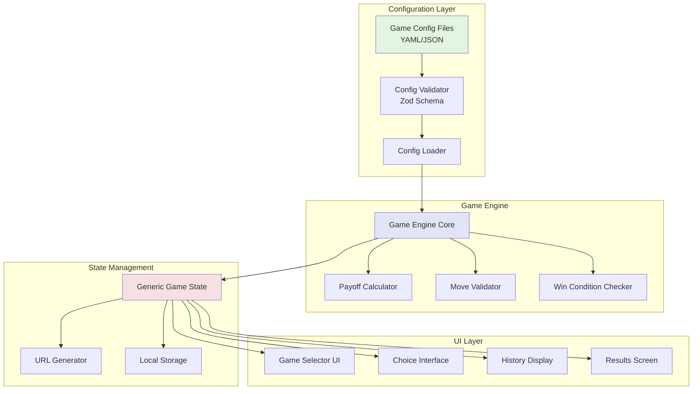
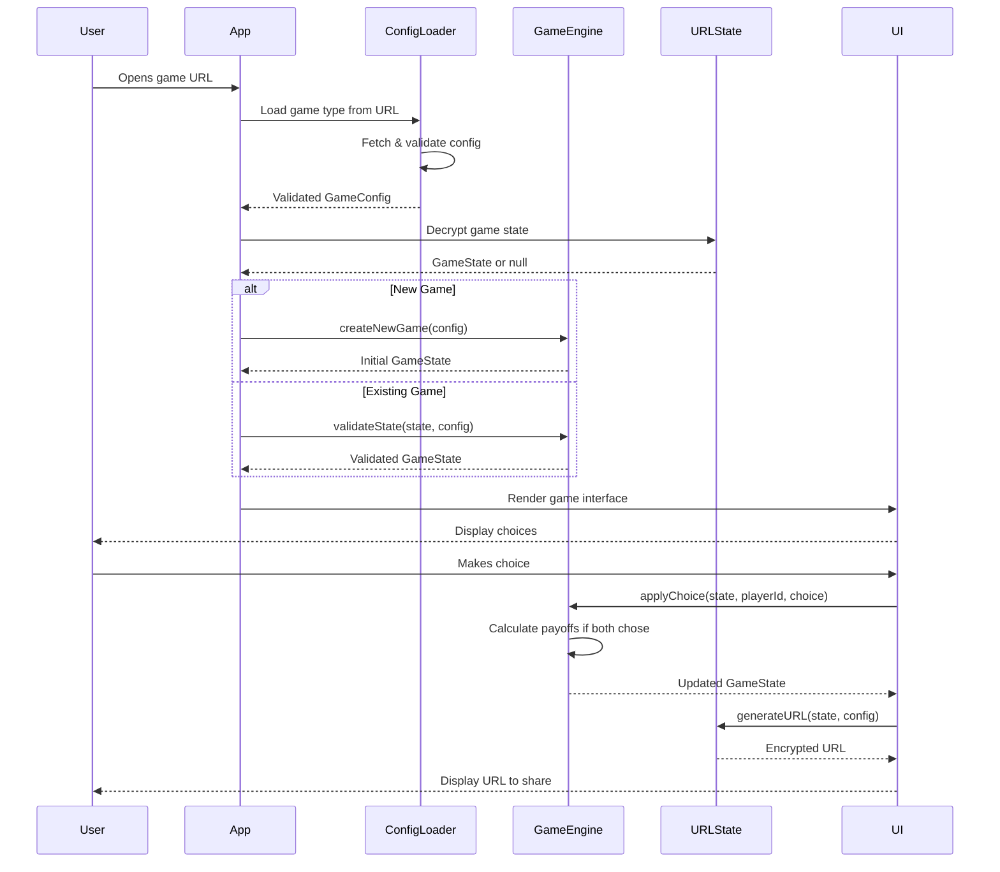
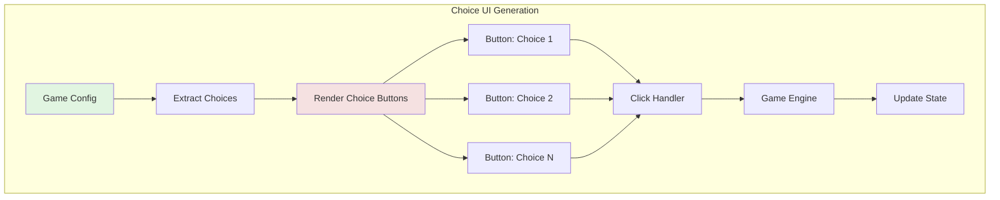
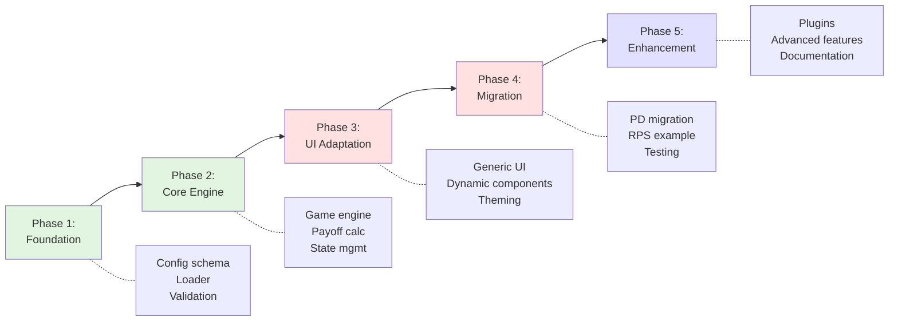

# Configurable Correspondence Game Framework - Planning PRD

## Executive Summary

### Problem Statement

The current correspondence game implementation (Prisoner's Dilemma) is **hardcoded and game-specific**, making it difficult to:
- Create new games without duplicating the entire codebase
- Experiment with different game mechanics, payoff structures, or turn patterns
- Share game templates across projects or with other developers
- Rapidly prototype game theory experiments

**Core Pain Point**: Creating a new game like Rock-Paper-Scissors currently requires modifying TypeScript components, payoff calculation functions, state schemas, and UI components across 15+ files.

### Solution Overview

A **declarative game configuration system** that allows new correspondence games to be defined via **JSON/YAML files** rather than code. The framework will:

1. **Parse game definitions** from configuration files
2. **Generate game logic** dynamically (payoffs, win conditions, valid moves)
3. **Render generic UI** that adapts to game structure
4. **Maintain existing features** (URL state, encryption, local storage, rematch)

**Key Insight**: All symmetric 2-player turn-based games share common patterns:
- Players make choices from a fixed set of options
- Payoffs are determined by a matrix of choice combinations
- Rounds accumulate to determine a winner
- State must be encoded/decoded for URL sharing

### Success Metrics

**Primary Goals:**
- **Dev Velocity**: Create a new game in < 30 minutes (vs. 3+ hours currently)
- **Code Reuse**: 80%+ of framework code shared across all games
- **Ease of Use**: Non-developers can define games via JSON

**Technical Goals:**
- **Backward Compatible**: Existing Prisoner's Dilemma continues working
- **URL Length**: Maintain < 1500 character URLs for complex games
- **Type Safety**: Full TypeScript validation for generated game logic

---

## User Stories & Scenarios

### Story 1: Game Designer Creates Rock-Paper-Scissors
**As a game designer**, I want to create a Rock-Paper-Scissors game by editing a JSON file, so that I can quickly test game mechanics without writing code.

**Acceptance Criteria:**
- [ ] Create `rock-paper-scissors.json` in `games/configs/` directory
- [ ] Define 3 choices: rock, paper, scissors
- [ ] Specify payoff matrix as nested object
- [ ] Set game to 1 round (best-of-1)
- [ ] Game is playable immediately upon saving file
- [ ] All UI labels and text come from config

**Edge Cases:**
- Invalid JSON syntax → Clear error message with line number
- Missing required fields → Validation error listing missing fields
- Circular payoff references → Detection and error
- Non-square payoff matrix → Validation error

### Story 2: Educator Tests Multiple Payoff Structures
**As an economics educator**, I want to create variants of Prisoner's Dilemma with different payoff values, so that I can demonstrate how outcomes change.

**Acceptance Criteria:**
- [ ] Clone `prisoners-dilemma.json` to `prisoners-dilemma-variant.json`
- [ ] Modify payoff values (e.g., 3→4 for cooperation)
- [ ] Both games coexist and are selectable
- [ ] URL routes differentiate games (`/game?type=pd-variant&s=...`)
- [ ] Game history tracks which variant was played

**Edge Cases:**
- Negative payoff values → Supported
- Non-integer payoffs → Supported (floats allowed)
- Asymmetric payoffs (P1 ≠ P2) → Supported

### Story 3: Researcher Defines Custom N-Round Game
**As a game theory researcher**, I want to configure a 10-round game with cumulative scoring, so that I can study repeated game dynamics.

**Acceptance Criteria:**
- [ ] Set `roundCount: 10` in config
- [ ] Specify `scoringMethod: cumulative` (vs. winner-per-round)
- [ ] Set `winCondition: highest-total` or `first-to-threshold`
- [ ] UI adapts to show all 10 rounds in history
- [ ] URL encoding handles 10 rounds within size limits

**Edge Cases:**
- Very high round counts (100+) → Warning about URL length
- Round count = 1 → Single-round mode (no round counter UI)
- Round count = 0 → Validation error

### Story 4: Developer Extends Framework
**As a developer**, I want to understand how to add custom game logic beyond payoff matrices, so that I can build more complex games.

**Acceptance Criteria:**
- [ ] Plugin system for custom validators
- [ ] Hook points for pre/post-turn logic
- [ ] Custom UI component injection
- [ ] Documentation with examples
- [ ] Type definitions exported for plugins

---

## Game Configuration Schema

### Configuration File Structure (JSON)

```json
{
  "gameType": "rock-paper-scissors",
  "version": "1.0.0",
  "metadata": {
    "displayName": "Rock Paper Scissors",
    "description": "Classic hand game played over correspondence",
    "author": "Framework Team",
    "tags": ["classic", "symmetric", "zero-sum"]
  },
  "rules": {
    "playerCount": 2,
    "roundCount": 1,
    "turnPattern": "simultaneous",
    "scoringMethod": "cumulative",
    "winCondition": {
      "type": "highest-total",
      "tiebreaker": "sudden-death-round"
    }
  },
  "choices": [
    {
      "id": "rock",
      "displayName": "Rock",
      "description": "Crushes scissors, loses to paper",
      "emoji": "🪨"
    },
    {
      "id": "paper",
      "displayName": "Paper",
      "description": "Covers rock, loses to scissors",
      "emoji": "📄"
    },
    {
      "id": "scissors",
      "displayName": "Scissors",
      "description": "Cuts paper, loses to rock",
      "emoji": "✂️"
    }
  ],
  "payoffMatrix": {
    "rock": {
      "rock": { "p1": 0, "p2": 0 },
      "paper": { "p1": -1, "p2": 1 },
      "scissors": { "p1": 1, "p2": -1 }
    },
    "paper": {
      "rock": { "p1": 1, "p2": -1 },
      "paper": { "p1": 0, "p2": 0 },
      "scissors": { "p1": -1, "p2": 1 }
    },
    "scissors": {
      "rock": { "p1": -1, "p2": 1 },
      "paper": { "p1": 1, "p2": -1 },
      "scissors": { "p1": 0, "p2": 0 }
    }
  },
  "presentation": {
    "theme": "classic",
    "showPayoffMatrix": true,
    "showHistory": true,
    "customMessages": {
      "welcome": "Choose your weapon!",
      "waiting": "Waiting for opponent's choice...",
      "roundComplete": "Round {roundNumber} complete!",
      "gameOver": "Game over! {winner} wins!"
    }
  }
}
```

### Alternative: YAML Configuration (More Human-Friendly)

```yaml
gameType: rock-paper-scissors
version: 1.0.0

metadata:
  displayName: Rock Paper Scissors
  description: Classic hand game played over correspondence
  author: Framework Team
  tags: [classic, symmetric, zero-sum]

rules:
  playerCount: 2
  roundCount: 1
  turnPattern: simultaneous  # or 'alternating', 'sequential'
  scoringMethod: cumulative  # or 'winner-per-round'
  winCondition:
    type: highest-total  # or 'first-to-threshold', 'best-of-n'
    tiebreaker: sudden-death-round

choices:
  - id: rock
    displayName: Rock
    description: Crushes scissors, loses to paper
    emoji: 🪨

  - id: paper
    displayName: Paper
    description: Covers rock, loses to scissors
    emoji: 📄

  - id: scissors
    displayName: Scissors
    description: Cuts paper, loses to rock
    emoji: ✂️

# Payoff matrix: first key = P1 choice, second key = P2 choice
payoffMatrix:
  rock:
    rock: { p1: 0, p2: 0 }
    paper: { p1: -1, p2: 1 }
    scissors: { p1: 1, p2: -1 }

  paper:
    rock: { p1: 1, p2: -1 }
    paper: { p1: 0, p2: 0 }
    scissors: { p1: -1, p2: 1 }

  scissors:
    rock: { p1: -1, p2: 1 }
    paper: { p1: 1, p2: -1 }
    scissors: { p1: 0, p2: 0 }

presentation:
  theme: classic
  showPayoffMatrix: true
  showHistory: true
  customMessages:
    welcome: Choose your weapon!
    waiting: Waiting for opponent's choice...
    roundComplete: Round {roundNumber} complete!
    gameOver: Game over! {winner} wins!
```

### Prisoner's Dilemma Example

```yaml
gameType: prisoners-dilemma
version: 1.0.0

metadata:
  displayName: Prisoner's Dilemma
  description: Classic game theory experiment - cooperate or defect?
  story: |
    Two prisoners are caught by the guards. Each is separated and
    offered a deal: give information about your partner in exchange
    for gold. Will you stay silent or talk?

rules:
  playerCount: 2
  roundCount: 5
  turnPattern: simultaneous
  scoringMethod: cumulative
  winCondition:
    type: highest-total

choices:
  - id: silent
    displayName: Stay Silent
    description: Cooperate with your partner
    emoji: 🤐

  - id: talk
    displayName: Talk
    description: Betray your partner for potential gain
    emoji: 🗣️

payoffMatrix:
  silent:
    silent: { p1: 3, p2: 3 }
    talk: { p1: 0, p2: 5 }

  talk:
    silent: { p1: 5, p2: 0 }
    talk: { p1: 1, p2: 1 }

presentation:
  theme: dungeon
  showPayoffMatrix: true
  showHistory: true
  customMessages:
    welcome: Will your partner stay silent through all 5 rounds?
    waiting: Waiting for your partner's decision...
    roundComplete: Round {roundNumber} results are in!
    gameOver: The guards count your gold...
```

---

## System Architecture

### High-Level Component Flow



### Data Flow: From Config to Gameplay



### Generic Game State Schema

```typescript
interface GenericGameState {
  // Meta
  version: string;
  gameType: string;  // References config file
  gameId: string;

  // Players
  players: {
    p1: PlayerInfo;
    p2: PlayerInfo;
  };

  // Game Progress
  currentRound: number;
  totalRounds: number;
  gamePhase: 'setup' | 'playing' | 'finished';

  // Rounds (flexible structure)
  rounds: GenericRound[];

  // Scores (can be any scoring method)
  scores: {
    p1: number | Record<string, number>;
    p2: number | Record<string, number>;
  };

  // Optional features
  metadata: GameMetadata;
  socialFeatures?: SocialFeatures;
}

interface GenericRound {
  roundNumber: number;
  choices: {
    p1?: string;  // Choice ID from config
    p2?: string;
  };
  results?: {
    p1Score: number;
    p2Score: number;
    metadata?: Record<string, any>;  // For game-specific data
  };
  isComplete: boolean;
  completedAt?: string;
}
```

### Configuration Schema (Zod)

```typescript
import { z } from 'zod';

export const GameConfigSchema = z.object({
  gameType: z.string().min(1),
  version: z.string().regex(/^\d+\.\d+\.\d+$/),

  metadata: z.object({
    displayName: z.string(),
    description: z.string(),
    author: z.string().optional(),
    tags: z.array(z.string()).optional(),
    story: z.string().optional(),
  }),

  rules: z.object({
    playerCount: z.literal(2),  // v1.0 only supports 2-player
    roundCount: z.number().int().min(1).max(100),
    turnPattern: z.enum(['simultaneous', 'alternating', 'sequential']),
    scoringMethod: z.enum(['cumulative', 'winner-per-round']),
    winCondition: z.object({
      type: z.enum(['highest-total', 'first-to-threshold', 'best-of-n']),
      threshold: z.number().optional(),
      tiebreaker: z.enum(['sudden-death-round', 'declare-tie']).optional(),
    }),
  }),

  choices: z.array(
    z.object({
      id: z.string().min(1),
      displayName: z.string(),
      description: z.string().optional(),
      emoji: z.string().optional(),
    })
  ).min(2),

  payoffMatrix: z.record(
    z.string(),
    z.record(
      z.string(),
      z.object({
        p1: z.number(),
        p2: z.number(),
      })
    )
  ),

  presentation: z.object({
    theme: z.string().optional(),
    showPayoffMatrix: z.boolean().default(true),
    showHistory: z.boolean().default(true),
    customMessages: z.record(z.string()).optional(),
  }).optional(),
});

export type GameConfig = z.infer<typeof GameConfigSchema>;
```

---

## Technical Specifications

### API Design: Game Engine Core

```typescript
// Core Engine Interface
class GameEngine {
  constructor(private config: GameConfig) {}

  /**
   * Creates initial game state from config
   */
  createNewGame(
    p1Name?: string,
    p2Name?: string
  ): GenericGameState;

  /**
   * Applies a player's choice to current state
   */
  applyChoice(
    state: GenericGameState,
    playerId: 'p1' | 'p2',
    choiceId: string
  ): GenericGameState;

  /**
   * Calculates payoffs based on config matrix
   */
  calculatePayoff(
    p1Choice: string,
    p2Choice: string
  ): { p1: number; p2: number };

  /**
   * Validates a choice is legal for current state
   */
  validateChoice(
    state: GenericGameState,
    playerId: 'p1' | 'p2',
    choiceId: string
  ): boolean;

  /**
   * Determines if round is complete
   */
  isRoundComplete(round: GenericRound): boolean;

  /**
   * Advances to next round or ends game
   */
  advanceRound(state: GenericGameState): GenericGameState;

  /**
   * Checks win condition from config
   */
  checkWinCondition(state: GenericGameState): {
    isComplete: boolean;
    winner?: 'p1' | 'p2' | 'tie';
  };
}
```

### Configuration Loader with Validation

```typescript
class GameConfigLoader {
  private cache: Map<string, GameConfig> = new Map();

  /**
   * Loads and validates game config
   * @throws {ConfigValidationError} if config is invalid
   */
  async loadConfig(gameType: string): Promise<GameConfig> {
    // Check cache first
    if (this.cache.has(gameType)) {
      return this.cache.get(gameType)!;
    }

    // Load from file system or API
    const raw = await this.fetchConfigFile(gameType);

    // Parse JSON or YAML
    const parsed = this.parseConfig(raw);

    // Validate with Zod schema
    const validated = GameConfigSchema.parse(parsed);

    // Additional validation (payoff matrix completeness)
    this.validatePayoffMatrix(validated);

    // Cache and return
    this.cache.set(gameType, validated);
    return validated;
  }

  /**
   * Ensures payoff matrix is complete and symmetric
   */
  private validatePayoffMatrix(config: GameConfig): void {
    const choiceIds = config.choices.map(c => c.id);

    for (const p1Choice of choiceIds) {
      if (!config.payoffMatrix[p1Choice]) {
        throw new ConfigValidationError(
          `Missing payoff matrix row for choice: ${p1Choice}`
        );
      }

      for (const p2Choice of choiceIds) {
        if (!config.payoffMatrix[p1Choice][p2Choice]) {
          throw new ConfigValidationError(
            `Missing payoff for combination: ${p1Choice} vs ${p2Choice}`
          );
        }
      }
    }
  }

  /**
   * Lists all available game configs
   */
  async listGames(): Promise<GameConfigMetadata[]> {
    // Scan /games/configs/ directory
    // Return metadata for each game
  }
}
```

### URL Generation with Game Type

```typescript
interface URLGenerationOptions {
  gameType: string;
  gameState: GenericGameState;
  config: GameConfig;
}

function generateGameURL(options: URLGenerationOptions): string {
  const { gameType, gameState, config } = options;

  // Compress state
  const compressed = compressState(gameState, config);

  // Encrypt
  const encrypted = encryptState(compressed);

  // Build URL with game type parameter
  const baseUrl = window.location.origin + window.location.pathname;
  const url = `${baseUrl}?type=${gameType}&s=${encrypted}`;

  return url;
}

function parseGameURL(url: string): {
  gameType: string;
  gameState: GenericGameState | null;
} {
  const params = new URLSearchParams(new URL(url).search);
  const gameType = params.get('type') || 'prisoners-dilemma';  // Default
  const stateParam = params.get('s');

  if (!stateParam) {
    return { gameType, gameState: null };
  }

  // Decrypt and decompress
  const gameState = decryptState(stateParam);

  return { gameType, gameState };
}
```

---

## UI Component Architecture

### Dynamic Choice Interface



### Generic Payoff Matrix Display

```typescript
interface PayoffMatrixProps {
  config: GameConfig;
  highlightCombination?: {
    p1Choice: string;
    p2Choice: string;
  };
}

function PayoffMatrixDisplay({ config, highlightCombination }: PayoffMatrixProps) {
  const { choices, payoffMatrix } = config;

  return (
    <div className="payoff-matrix">
      <table>
        <thead>
          <tr>
            <th></th>
            {choices.map(choice => (
              <th key={choice.id}>
                {choice.emoji} {choice.displayName}
              </th>
            ))}
          </tr>
        </thead>
        <tbody>
          {choices.map(p1Choice => (
            <tr key={p1Choice.id}>
              <th>
                {p1Choice.emoji} {p1Choice.displayName}
              </th>
              {choices.map(p2Choice => {
                const payoff = payoffMatrix[p1Choice.id][p2Choice.id];
                const isHighlighted =
                  highlightCombination?.p1Choice === p1Choice.id &&
                  highlightCombination?.p2Choice === p2Choice.id;

                return (
                  <td
                    key={p2Choice.id}
                    className={isHighlighted ? 'highlighted' : ''}
                  >
                    <div className="payoff-cell">
                      <span className="p1-payoff">You: {payoff.p1}</span>
                      <span className="p2-payoff">Them: {payoff.p2}</span>
                    </div>
                  </td>
                );
              })}
            </tr>
          ))}
        </tbody>
      </table>
    </div>
  );
}
```

---

## Implementation Strategy

### Development Phases



### Phase 1: Foundation (Week 1)

**Goal**: Configuration infrastructure

**Tasks**:
1. Create Zod schema for game configs (`GameConfigSchema`)
2. Implement config loader with file system access
3. Build config validator with detailed error messages
4. Create example configs (PD, RPS, custom variant)
5. Write unit tests for validation logic

**Deliverables**:
- `src/features/game-engine/schemas/gameConfig.ts`
- `src/features/game-engine/loaders/configLoader.ts`
- `games/configs/prisoners-dilemma.yaml`
- `games/configs/rock-paper-scissors.yaml`

**Validation**:
```bash
npm run test -- game-engine/loaders
npm run validate-configs
```

### Phase 2: Core Engine (Week 2)

**Goal**: Generic game logic engine

**Tasks**:
1. Create `GameEngine` class with config-driven logic
2. Implement generic payoff calculator
3. Build generic state machine (rounds, turns, completion)
4. Adapt URL generation for game type parameter
5. Create generic state schema alongside existing one

**Deliverables**:
- `src/features/game-engine/core/GameEngine.ts`
- `src/features/game-engine/core/payoffEngine.ts`
- `src/features/game-engine/schemas/genericGameState.ts`

**Validation**:
```bash
npm run test -- game-engine/core
# All tests should pass for RPS and PD configs
```

### Phase 3: UI Adaptation (Week 2-3)

**Goal**: Dynamic UI components

**Tasks**:
1. Create `<GenericChoiceInterface>` component
2. Build `<DynamicPayoffMatrix>` component
3. Implement game selector UI for homepage
4. Add theme system for different visual styles
5. Create generic messaging system with config templates

**Deliverables**:
- `src/features/game-engine/components/GenericChoiceInterface.tsx`
- `src/features/game-engine/components/DynamicPayoffMatrix.tsx`
- `src/features/game-engine/components/GameSelector.tsx`

**Validation**:
- Manual testing with RPS config
- Visual regression tests
- Accessibility audit

### Phase 4: Migration & Testing (Week 3-4)

**Goal**: Migrate existing PD, validate with new game

**Tasks**:
1. Create `prisoners-dilemma.yaml` config file
2. Update App.tsx to use GameEngine for both modes
3. Ensure existing PD URLs still work (backward compatibility)
4. Create complete Rock-Paper-Scissors game
5. End-to-end testing of both games

**Deliverables**:
- Migrated Prisoner's Dilemma
- Fully functional Rock-Paper-Scissors
- Backward compatibility layer
- E2E test suite

**Validation**:
```bash
npm run test:e2e -- prisoners-dilemma
npm run test:e2e -- rock-paper-scissors
npm run test:integration -- all-games
```

### Phase 5: Enhancement & Documentation (Week 4-5)

**Goal**: Polish and extensibility

**Tasks**:
1. Plugin system for custom validators
2. Advanced win conditions (thresholds, best-of-n)
3. Game gallery page showcasing all configs
4. Comprehensive documentation
5. Tutorial for creating new games

**Deliverables**:
- `docs/creating-games.md`
- `docs/config-reference.md`
- `docs/plugin-api.md`
- Example plugins
- Game templates repository

---

## Implementation Priority

### MVP (Minimum Viable Product)
1. ✅ Config loader with validation
2. ✅ Generic game engine core
3. ✅ Basic dynamic UI (choice buttons, payoff matrix)
4. ✅ Rock-Paper-Scissors working example
5. ✅ Prisoner's Dilemma migrated to config

### Enhanced Features
- [ ] Game selector homepage
- [ ] Multiple themes (dungeon, classic, modern)
- [ ] Advanced win conditions
- [ ] Custom validators

### Future Enhancements
- [ ] Multi-round games with different choice sets per round
- [ ] 3+ player support
- [ ] Asymmetric games (different choices for P1/P2)
- [ ] Visual game designer (no-code config builder)
- [ ] Game sharing platform

---

## Challenge & Risk Analysis

### Technical Risks

#### Risk 1: URL Length with Complex Games
**Scenario**: Game with 10 choices and 20 rounds exceeds URL limit

**Mitigation**:
- Use choice IDs (e.g., `"r"` instead of `"rock"`) for compression
- Store only move history, not full state
- Warning system for config validation
- Fallback to localStorage + short code

#### Risk 2: Type Safety with Dynamic Configs
**Scenario**: TypeScript can't validate dynamically loaded configs

**Mitigation**:
- Strict Zod schemas with runtime validation
- Generated TypeScript types from configs
- Comprehensive test coverage
- Clear error messages for config issues

#### Risk 3: Backward Compatibility
**Scenario**: Existing PD URLs break after migration

**Mitigation**:
- Detect old URL format (no `type` param)
- Default to PD config for legacy URLs
- State migration layer
- Extensive regression testing

### Edge Cases to Handle

#### Config Validation Edge Cases
```yaml
# Case 1: Invalid payoff matrix (missing combinations)
payoffMatrix:
  rock:
    rock: { p1: 0, p2: 0 }
    # Missing: paper, scissors

# Case 2: Circular dependencies
choices:
  - id: rock
    counters: paper
  - id: paper
    counters: scissors
  - id: scissors
    counters: rock  # Could create infinite loop

# Case 3: Asymmetric payoffs (supported but flag as warning)
payoffMatrix:
  rock:
    rock: { p1: 1, p2: 0 }  # Not symmetric
```

#### Gameplay Edge Cases
- **All ties**: Game where every combination is 0,0
- **No winning moves**: Payoff matrix with only negative values
- **Extremely long games**: 100+ rounds
- **Single choice**: Game with only 1 option (trivial but valid)

#### UI Edge Cases
- **Very long choice names**: "The extremely verbose choice that breaks layout"
- **No emojis**: Fallback to text-only display
- **Too many choices**: 20+ choices in matrix (layout challenge)

---

## Success Criteria

### Definition of Done

**Framework Functionality**:
- [ ] Rock-Paper-Scissors playable via config
- [ ] Prisoner's Dilemma migrated to config
- [ ] All existing tests passing
- [ ] E2E tests for both games
- [ ] URL generation/parsing works for both

**Developer Experience**:
- [ ] Create new game in < 30 minutes
- [ ] Clear config error messages
- [ ] Documentation with examples
- [ ] Type-safe config editing (IDE autocomplete)

**Code Quality**:
- [ ] Test coverage > 80%
- [ ] No TypeScript errors
- [ ] ESLint clean
- [ ] Performance benchmarks met (< 100ms state updates)

### Measurable Outcomes

**Primary Metrics**:
- **Game Creation Time**: Baseline 3 hours → Target < 30 minutes
- **Code Reuse**: 80%+ of framework code shared
- **Config Errors**: 100% caught with clear messages
- **URL Size**: Maintain < 1500 chars for 5-round games

**Quality Metrics**:
- **Test Coverage**: > 80% for game engine
- **Type Safety**: 100% TypeScript strict mode
- **Accessibility**: WCAG AA compliant
- **Performance**: < 100ms per state update

---

## Appendices

### Appendix A: Example Game Configs

#### Matching Pennies
```yaml
gameType: matching-pennies
rules:
  roundCount: 5
  turnPattern: simultaneous
  winCondition:
    type: highest-total

choices:
  - id: heads
    displayName: Heads
    emoji: 🟡
  - id: tails
    displayName: Tails
    emoji: ⚫

payoffMatrix:
  heads:
    heads: { p1: 1, p2: -1 }
    tails: { p1: -1, p2: 1 }
  tails:
    heads: { p1: -1, p2: 1 }
    tails: { p1: 1, p2: -1 }
```

#### Stag Hunt
```yaml
gameType: stag-hunt
metadata:
  story: |
    Two hunters can either hunt a stag together (requires cooperation)
    or hunt rabbits alone (safe but less rewarding).

choices:
  - id: stag
    displayName: Hunt Stag
    description: Requires both hunters, high reward
  - id: rabbit
    displayName: Hunt Rabbit
    description: Safe solo option, lower reward

payoffMatrix:
  stag:
    stag: { p1: 4, p2: 4 }      # Mutual cooperation
    rabbit: { p1: 0, p2: 2 }    # Partner defected
  rabbit:
    stag: { p1: 2, p2: 0 }      # I defected
    rabbit: { p1: 2, p2: 2 }    # Both play safe
```

### Appendix B: Plugin System Design

```typescript
// Plugin interface for custom game logic
interface GamePlugin {
  name: string;
  version: string;

  // Hook: Validate a choice before applying
  validateChoice?(
    state: GenericGameState,
    playerId: 'p1' | 'p2',
    choiceId: string,
    config: GameConfig
  ): boolean | { valid: boolean; reason?: string };

  // Hook: Transform state after choice applied
  afterChoice?(
    state: GenericGameState,
    playerId: 'p1' | 'p2',
    choiceId: string,
    config: GameConfig
  ): GenericGameState;

  // Hook: Custom win condition logic
  checkWinCondition?(
    state: GenericGameState,
    config: GameConfig
  ): { isComplete: boolean; winner?: 'p1' | 'p2' | 'tie' };

  // Hook: Custom UI components
  components?: {
    ChoiceInterface?: React.ComponentType<any>;
    ResultsDisplay?: React.ComponentType<any>;
  };
}

// Register plugin
GameEngine.registerPlugin(myPlugin);
```

### Appendix C: Research References

**Game Theory Resources**:
- Rock-Paper-Scissors payoff matrix: Cornell Networks Course
- Zero-sum game theory: Stanford CS
- Nash Equilibrium in RPS: World RPS Association

**Technical Patterns**:
- Hexboard framework (2018): JSON-based turn-based games
- JSON Schema validation best practices
- Dynamic React component generation

**URL-Based Games**:
- Lichess FEN notation
- lz-string compression library
- Web Crypto API for state integrity

---

## Next Steps

After this PRD is approved:

1. **Create Implementation PRP** using `/prp-base-create`
   - Input: This PRD
   - Output: Detailed implementation plan with code examples

2. **Spike: Config Loader** (2 days)
   - Prototype YAML parsing
   - Validate Zod schema approach
   - Test with RPS config

3. **Team Review**
   - Technical feasibility
   - Resource allocation
   - Timeline adjustment

4. **Begin Phase 1** (Foundation)
   - Create config schemas
   - Build loader with validation
   - Write example configs

**Estimated Total Timeline**: 4-5 weeks for MVP

---

## Open Questions for Stakeholders

1. **Config Format**: Preference for JSON vs YAML? (YAML more readable, JSON more standard)
2. **Game Discovery**: Should we build a game gallery UI or keep it simple with direct URLs?
3. **Versioning**: How should we handle config version migrations?
4. **Multi-player**: Is 3+ player support a future requirement? (Affects architecture)
5. **Hosting**: Where should game config files be hosted? (Git repo, API, CDN?)

---

**Document Version**: 1.0.0
**Created**: 2025-10-04
**Status**: Draft - Awaiting Review
**Next Review**: Implementation PRP Creation
