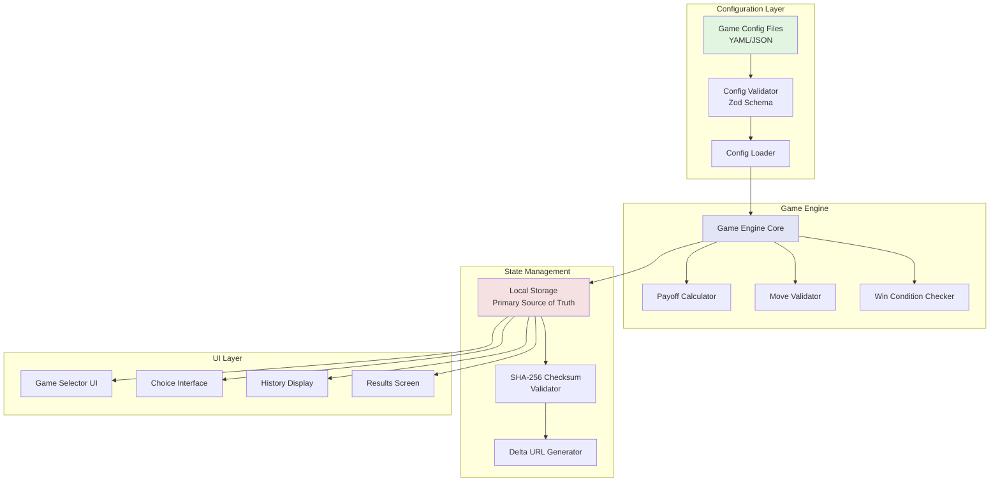
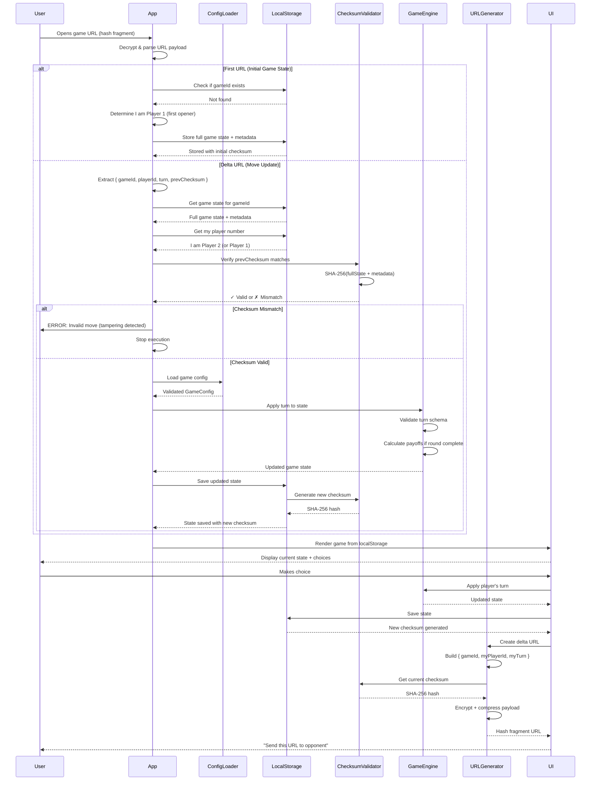
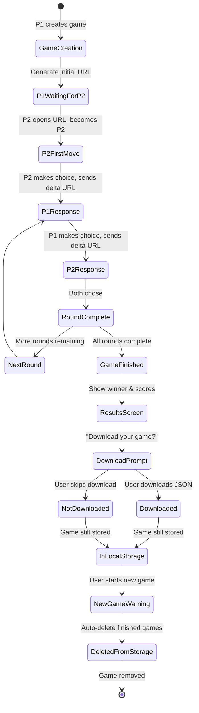
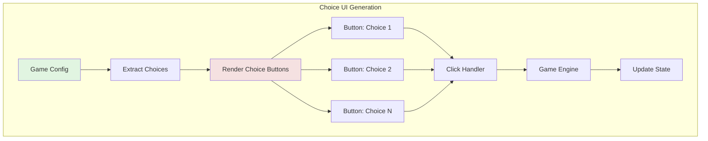
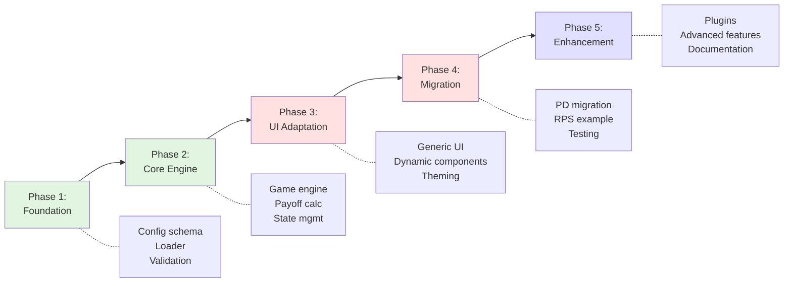

# Configurable Correspondence Game Framework - Planning PRD

> **Repository Context**: This is the `correspondence-games` PRP workspace repository - a development environment using Claude Code to create and manage correspondence games.
>
> **Multi-Repository Architecture**:
> - **`correspondence-games-framework`** - Master framework repo with game links (separate repo, gitignored here)
> - **Individual game repos** (e.g., `prisoners-dilemma-game`, `rock-paper-scissors-game`) - Each deploys to GitHub Pages
> - **This repo (`correspondence-games`)** - PRP workspace for Claude Code development workflows
>
> **Framework Documentation** (in `correspondence-games-framework` repo):
> - `framework-considerations.md` - Core architecture patterns
> - `security-considerations.md` - Security implementation guide
> - Links to all deployed game instances

## Executive Summary

### Problem Statement

The current correspondence game implementation (Prisoner's Dilemma) is **hardcoded and game-specific**, making it difficult to:
- Create new games without duplicating the entire codebase
- Experiment with different game mechanics, payoff structures, or turn patterns
- Share game templates across projects or with other developers
- Rapidly prototype game theory experiments

**Core Pain Point**: Creating a new game like Rock-Paper-Scissors currently requires modifying TypeScript components, payoff calculation functions, state schemas, and UI components across 15+ files.

### Solution Overview

A **declarative game configuration system** that allows new correspondence games to be defined via **JSON/YAML files** rather than code. The framework will:

1. **Parse game definitions** from configuration files
2. **Generate game logic** dynamically (payoffs, win conditions, valid moves)
3. **Render generic UI** that adapts to game structure
4. **Use localStorage as primary state storage** with delta-based URL sharing
5. **Implement SHA-256 checksum verification** for move validation

**Key Architectural Shifts:**
- **localStorage-first**: Full game history stored locally, not in URLs
- **Delta-based URLs**: URLs contain only latest move + checksum (not full state)
- **Checksum verification**: SHA-256 hash validates entire game history
- **No backward compatibility**: Clean break from existing Prisoner's Dilemma implementation

**Key Insight**: All symmetric 2-player turn-based games share common patterns:
- Players make choices from a fixed set of options
- Payoffs are determined by a matrix of choice combinations
- Rounds accumulate to determine a winner
- Turn structure defined per-game in configuration

### Success Metrics

**Primary Goals:**
- **Dev Velocity**: Create a new game in < 30 minutes (vs. 3+ hours currently)
- **Code Reuse**: 80%+ of framework code shared across all games
- **Ease of Use**: Non-developers can define games via JSON/YAML
- **URL Efficiency**: Minimal URL length (only deltas, not full state)

**Technical Goals:**
- **Fresh Start**: No backward compatibility constraints
- **Security**: SHA-256 checksum prevents tampering
- **Type Safety**: Full TypeScript validation for generated game logic
- **localStorage Reliance**: Games require persistent storage (no cross-device resume)

---

## User Stories & Scenarios

### Story 1: Game Designer Creates Rock-Paper-Scissors
**As a game designer**, I want to create a Rock-Paper-Scissors game by editing a JSON file, so that I can quickly test game mechanics without writing code.

**Acceptance Criteria:**
- [ ] Create `rock-paper-scissors.json` in `games/configs/` directory
- [ ] Define 3 choices: rock, paper, scissors
- [ ] Specify payoff matrix as nested object
- [ ] Set game to 1 round (best-of-1)
- [ ] Game is playable immediately upon saving file
- [ ] All UI labels and text come from config

**Edge Cases:**
- Invalid JSON syntax → Clear error message with line number
- Missing required fields → Validation error listing missing fields
- Circular payoff references → Detection and error
- Non-square payoff matrix → Validation error

### Story 2: Educator Tests Multiple Payoff Structures
**As an economics educator**, I want to create variants of Prisoner's Dilemma with different payoff values, so that I can demonstrate how outcomes change.

**Acceptance Criteria:**
- [ ] Clone `prisoners-dilemma.yaml` to `prisoners-dilemma-variant.yaml`
- [ ] Modify payoff values (e.g., 3→4 for cooperation)
- [ ] Both games coexist and are selectable
- [ ] localStorage tracks which game type was played
- [ ] Can download game history as JSON file

**Edge Cases:**
- Negative payoff values → Supported
- Non-integer payoffs → Supported (floats allowed)
- Asymmetric payoffs (P1 ≠ P2) → Supported

### Story 3: Researcher Defines Custom N-Round Game
**As a game theory researcher**, I want to configure a 10-round game with cumulative scoring, so that I can study repeated game dynamics.

**Acceptance Criteria:**
- [ ] Set `roundCount: 10` in config
- [ ] Specify `scoringMethod: cumulative` (vs. winner-per-round)
- [ ] Set `winCondition: highest-total` or `first-to-threshold`
- [ ] UI adapts to show all 10 rounds in history
- [ ] localStorage stores full history regardless of round count

**Edge Cases:**
- Very high round counts (100+) → localStorage can handle it
- Round count = 1 → Single-round mode (no round counter UI)
- Round count = 0 → Validation error

### Story 4: Player Completes Game and Downloads History
**As a player**, I want to download my game history when a game finishes, so that I can keep a record of each move before it's deleted from my browser.

**Acceptance Criteria:**
- [ ] When game reaches "finished" status, show results screen
- [ ] Results screen displays download button with clear messaging
- [ ] Notice: "This game will be deleted when you start a new game"
- [ ] Download creates JSON file with complete game history
- [ ] Downloaded file includes: all rounds, all choices made by both players for each round, scores, timestamps, player names, move-by-move history
- [ ] Starting a new game auto-deletes finished games from localStorage

**Edge Cases:**
- User closes tab without downloading → Game still in localStorage until new game started
- User downloads multiple times → Each download creates new file
- localStorage full → Show warning before allowing new game start

### Story 5: Developer Extends Framework
**As a developer**, I want to understand how to add custom game logic beyond payoff matrices, so that I can build more complex games.

**Acceptance Criteria:**
- [ ] Plugin system for custom validators
- [ ] Hook points for pre/post-turn logic
- [ ] Custom UI component injection
- [ ] Documentation with examples
- [ ] Type definitions exported for plugins
- [ ] Config can define custom turn object schema

---

## Game Configuration Schema

### Configuration File Structure (JSON)

```json
{
  "gameType": "rock-paper-scissors",
  "version": "1.0.0",
  "metadata": {
    "displayName": "Rock Paper Scissors",
    "description": "Classic hand game played over correspondence",
    "author": "Framework Team",
    "tags": ["classic", "symmetric", "zero-sum"]
  },
  "rules": {
    "playerCount": 2,
    "roundCount": 1,
    "turnPattern": "simultaneous",
    "scoringMethod": "cumulative",
    "winCondition": {
      "type": "highest-total",
      "tiebreaker": "sudden-death-round"
    }
  },
  "turnSchema": {
    "type": "object",
    "properties": {
      "choice": {
        "type": "string",
        "enum": ["rock", "paper", "scissors"]
      }
    },
    "required": ["choice"]
  },
  "choices": [
    {
      "id": "rock",
      "displayName": "Rock",
      "description": "Crushes scissors, loses to paper",
      "emoji": "🪨"
    },
    {
      "id": "paper",
      "displayName": "Paper",
      "description": "Covers rock, loses to scissors",
      "emoji": "📄"
    },
    {
      "id": "scissors",
      "displayName": "Scissors",
      "description": "Cuts paper, loses to rock",
      "emoji": "✂️"
    }
  ],
  "payoffMatrix": {
    "rock": {
      "rock": { "p1": 0, "p2": 0 },
      "paper": { "p1": -1, "p2": 1 },
      "scissors": { "p1": 1, "p2": -1 }
    },
    "paper": {
      "rock": { "p1": 1, "p2": -1 },
      "paper": { "p1": 0, "p2": 0 },
      "scissors": { "p1": -1, "p2": 1 }
    },
    "scissors": {
      "rock": { "p1": -1, "p2": 1 },
      "paper": { "p1": 1, "p2": -1 },
      "scissors": { "p1": 0, "p2": 0 }
    }
  },
  "presentation": {
    "theme": "classic",
    "showPayoffMatrix": true,
    "showHistory": true,
    "customMessages": {
      "welcome": "Choose your weapon!",
      "waiting": "Waiting for opponent's choice...",
      "roundComplete": "Round {roundNumber} complete!",
      "gameOver": "Game over! {winner} wins!"
    }
  }
}
```

### Alternative: YAML Configuration (More Human-Friendly)

```yaml
gameType: rock-paper-scissors
version: 1.0.0

metadata:
  displayName: Rock Paper Scissors
  description: Classic hand game played over correspondence
  author: Framework Team
  tags: [classic, symmetric, zero-sum]

rules:
  playerCount: 2
  roundCount: 1
  turnPattern: simultaneous  # or 'alternating', 'sequential'
  scoringMethod: cumulative  # or 'winner-per-round'
  winCondition:
    type: highest-total  # or 'first-to-threshold', 'best-of-n'
    tiebreaker: sudden-death-round

# JSON Schema for turn object structure (sent in URLs)
turnSchema:
  type: object
  properties:
    choice:
      type: string
      enum: [rock, paper, scissors]
  required: [choice]

choices:
  - id: rock
    displayName: Rock
    description: Crushes scissors, loses to paper
    emoji: 🪨

  - id: paper
    displayName: Paper
    description: Covers rock, loses to scissors
    emoji: 📄

  - id: scissors
    displayName: Scissors
    description: Cuts paper, loses to rock
    emoji: ✂️

# Payoff matrix: first key = P1 choice, second key = P2 choice
payoffMatrix:
  rock:
    rock: { p1: 0, p2: 0 }
    paper: { p1: -1, p2: 1 }
    scissors: { p1: 1, p2: -1 }

  paper:
    rock: { p1: 1, p2: -1 }
    paper: { p1: 0, p2: 0 }
    scissors: { p1: -1, p2: 1 }

  scissors:
    rock: { p1: -1, p2: 1 }
    paper: { p1: 1, p2: -1 }
    scissors: { p1: 0, p2: 0 }

presentation:
  theme: classic
  showPayoffMatrix: true
  showHistory: true
  customMessages:
    welcome: Choose your weapon!
    waiting: Waiting for opponent's choice...
    roundComplete: Round {roundNumber} complete!
    gameOver: Game over! {winner} wins!
```

### Prisoner's Dilemma Example

```yaml
gameType: prisoners-dilemma
version: 1.0.0

metadata:
  displayName: Prisoner's Dilemma
  description: Classic game theory experiment - cooperate or defect?
  story: |
    Two prisoners are caught by the guards. Each is separated and
    offered a deal: give information about your partner in exchange
    for gold. Will you stay silent or talk?

rules:
  playerCount: 2
  roundCount: 5
  turnPattern: simultaneous
  scoringMethod: cumulative
  winCondition:
    type: highest-total

choices:
  - id: silent
    displayName: Stay Silent
    description: Cooperate with your partner
    emoji: 🤐

  - id: talk
    displayName: Talk
    description: Betray your partner for potential gain
    emoji: 🗣️

payoffMatrix:
  silent:
    silent: { p1: 3, p2: 3 }
    talk: { p1: 0, p2: 5 }

  talk:
    silent: { p1: 5, p2: 0 }
    talk: { p1: 1, p2: 1 }

presentation:
  theme: dungeon
  showPayoffMatrix: true
  showHistory: true
  customMessages:
    welcome: Will your partner stay silent through all 5 rounds?
    waiting: Waiting for your partner's decision...
    roundComplete: Round {roundNumber} results are in!
    gameOver: The guards count your gold...
```

---

## System Architecture

### High-Level Component Flow



### Data Flow: Delta-Based URL + localStorage Architecture



### localStorage Data Structures

```typescript
/**
 * Complete game record stored in localStorage
 * Key: `game-{gameId}`
 * Checksum includes EVERYTHING in this structure
 */
interface LocalStorageGameRecord {
  // Game State (core game data)
  gameState: GenericGameState;

  // Metadata (tracked for checksum)
  metadata: {
    gameType: string;           // Which config file
    gameId: string;             // UUID
    myPlayerNumber: 'p1' | 'p2'; // Who am I in this game
    myPlayerName: string;        // My display name (cannot change)
    opponentName?: string;       // Opponent's name
    createdAt: string;           // ISO timestamp
    lastMoveAt: string;          // ISO timestamp
    turnCount: number;           // Total turns taken
  };

  // Checksum (SHA-256 of gameState + metadata)
  checksum: string;
}

/**
 * Generic game state (stored within LocalStorageGameRecord)
 */
interface GenericGameState {
  version: string;               // "1.0.0"
  currentRound: number;
  totalRounds: number;
  gamePhase: 'setup' | 'playing' | 'finished';

  // Rounds with flexible turn structure
  rounds: GenericRound[];

  // Cumulative scores
  scores: {
    p1: number;
    p2: number;
  };
}

/**
 * Generic round (turn structure defined by game config)
 */
interface GenericRound {
  roundNumber: number;
  turns: {
    p1?: any;  // Validated against config.turnSchema
    p2?: any;  // Validated against config.turnSchema
  };
  results?: {
    p1Score: number;
    p2Score: number;
  };
  isComplete: boolean;
  completedAt?: string;
}
```

### URL Payload Structures

```typescript
/**
 * Initial URL payload (first game creation)
 * Contains full state since recipient has no localStorage
 */
interface InitialURLPayload {
  type: 'initial';
  gameType: string;
  gameState: GenericGameState;
  metadata: {
    gameId: string;
    createdAt: string;
    p1Name?: string;
    p2Name?: string;
  };
  checksum: string;  // Checksum of initial state
}

/**
 * Delta URL payload (subsequent moves)
 * Only contains latest turn + verification
 */
interface DeltaURLPayload {
  type: 'delta';
  gameId: string;
  playerId: 'p1' | 'p2';
  turn: any;  // Structure defined by config.turnSchema
  previousChecksum: string;  // For verification
}

/**
 * Encrypted URL structure (what actually goes in hash fragment)
 * After compression, encryption, and HMAC signing of above payloads
 *
 * CRITICAL SECURITY: Format is base64(encrypted_data.hmac_signature)
 * - Encryption provides confidentiality (unreadable)
 * - HMAC provides integrity (tamper-proof)
 */
type EncryptedURLFragment = string;  // base64(encrypted(compressed(payload)).hmac_signature)
```

### Configuration Schema (Zod)

```typescript
import { z } from 'zod';

export const GameConfigSchema = z.object({
  gameType: z.string().min(1),
  version: z.string().regex(/^\d+\.\d+\.\d+$/),

  metadata: z.object({
    displayName: z.string(),
    description: z.string(),
    author: z.string().optional(),
    tags: z.array(z.string()).optional(),
    story: z.string().optional(),
  }),

  rules: z.object({
    playerCount: z.literal(2),  // v1.0 only supports 2-player
    roundCount: z.number().int().min(1).max(100),
    turnPattern: z.enum(['simultaneous', 'alternating', 'sequential']),
    scoringMethod: z.enum(['cumulative', 'winner-per-round']),
    winCondition: z.object({
      type: z.enum(['highest-total', 'first-to-threshold', 'best-of-n']),
      threshold: z.number().optional(),
      tiebreaker: z.enum(['sudden-death-round', 'declare-tie']).optional(),
    }),
  }),

  // JSON Schema definition for turn object structure
  turnSchema: z.object({
    type: z.literal('object'),
    properties: z.record(z.any()),
    required: z.array(z.string()).optional(),
  }),

  choices: z.array(
    z.object({
      id: z.string().min(1),
      displayName: z.string(),
      description: z.string().optional(),
      emoji: z.string().optional(),
    })
  ).min(2),

  payoffMatrix: z.record(
    z.string(),
    z.record(
      z.string(),
      z.object({
        p1: z.number(),
        p2: z.number(),
      })
    )
  ),

  presentation: z.object({
    theme: z.string().optional(),
    showPayoffMatrix: z.boolean().default(true),
    showHistory: z.boolean().default(true),
    customMessages: z.record(z.string()).optional(),
  }).optional(),
});

export type GameConfig = z.infer<typeof GameConfigSchema>;
```

---

## Technical Specifications

### API Design: Game Engine Core

```typescript
// Core Engine Interface
class GameEngine {
  constructor(private config: GameConfig) {}

  /**
   * Creates initial game state from config
   */
  createNewGame(
    p1Name?: string,
    p2Name?: string
  ): GenericGameState;

  /**
   * Applies a player's choice to current state
   */
  applyChoice(
    state: GenericGameState,
    playerId: 'p1' | 'p2',
    choiceId: string
  ): GenericGameState;

  /**
   * Calculates payoffs based on config matrix
   */
  calculatePayoff(
    p1Choice: string,
    p2Choice: string
  ): { p1: number; p2: number };

  /**
   * Validates a choice is legal for current state
   */
  validateChoice(
    state: GenericGameState,
    playerId: 'p1' | 'p2',
    choiceId: string
  ): boolean;

  /**
   * Determines if round is complete
   */
  isRoundComplete(round: GenericRound): boolean;

  /**
   * Advances to next round or ends game
   */
  advanceRound(state: GenericGameState): GenericGameState;

  /**
   * Checks win condition from config
   */
  checkWinCondition(state: GenericGameState): {
    isComplete: boolean;
    winner?: 'p1' | 'p2' | 'tie';
  };
}
```

### Configuration Loader with Validation

```typescript
class GameConfigLoader {
  private cache: Map<string, GameConfig> = new Map();

  /**
   * Loads and validates game config
   * @throws {ConfigValidationError} if config is invalid
   */
  async loadConfig(gameType: string): Promise<GameConfig> {
    // Check cache first
    if (this.cache.has(gameType)) {
      return this.cache.get(gameType)!;
    }

    // Load from file system or API
    const raw = await this.fetchConfigFile(gameType);

    // Parse JSON or YAML
    const parsed = this.parseConfig(raw);

    // Validate with Zod schema
    const validated = GameConfigSchema.parse(parsed);

    // Additional validation (payoff matrix completeness)
    this.validatePayoffMatrix(validated);

    // Cache and return
    this.cache.set(gameType, validated);
    return validated;
  }

  /**
   * Ensures payoff matrix is complete and symmetric
   */
  private validatePayoffMatrix(config: GameConfig): void {
    const choiceIds = config.choices.map(c => c.id);

    for (const p1Choice of choiceIds) {
      if (!config.payoffMatrix[p1Choice]) {
        throw new ConfigValidationError(
          `Missing payoff matrix row for choice: ${p1Choice}`
        );
      }

      for (const p2Choice of choiceIds) {
        if (!config.payoffMatrix[p1Choice][p2Choice]) {
          throw new ConfigValidationError(
            `Missing payoff for combination: ${p1Choice} vs ${p2Choice}`
          );
        }
      }
    }
  }

  /**
   * Lists all available game configs
   */
  async listGames(): Promise<GameConfigMetadata[]> {
    // Scan /games/configs/ directory
    // Return metadata for each game
  }
}
```

### localStorage Manager with Checksum

```typescript
class LocalStorageGameManager {
  /**
   * Saves game to localStorage and generates checksum
   */
  saveGame(record: LocalStorageGameRecord): void {
    // Generate SHA-256 checksum of entire record (minus checksum field)
    const checksum = this.generateChecksum(record);

    const recordWithChecksum = {
      ...record,
      checksum,
    };

    const key = `game-${record.metadata.gameId}`;
    localStorage.setItem(key, JSON.stringify(recordWithChecksum));
  }

  /**
   * Loads game from localStorage and verifies checksum
   */
  loadGame(gameId: string): LocalStorageGameRecord | null {
    const key = `game-${gameId}`;
    const raw = localStorage.getItem(key);

    if (!raw) return null;

    const record: LocalStorageGameRecord = JSON.parse(raw);

    // Verify checksum
    const expectedChecksum = this.generateChecksum(record);
    if (record.checksum !== expectedChecksum) {
      throw new Error('localStorage corruption detected');
    }

    return record;
  }

  /**
   * Generates SHA-256 checksum of game record
   * Includes: gameState + metadata (but NOT checksum field)
   */
  async generateChecksum(record: Omit<LocalStorageGameRecord, 'checksum'>): Promise<string> {
    const dataToHash = {
      gameState: record.gameState,
      metadata: record.metadata,
    };

    const jsonString = JSON.stringify(dataToHash);
    const encoder = new TextEncoder();
    const data = encoder.encode(jsonString);

    const hashBuffer = await crypto.subtle.digest('SHA-256', data);
    const hashArray = Array.from(new Uint8Array(hashBuffer));
    const hashHex = hashArray.map(b => b.toString(16).padStart(2, '0')).join('');

    return hashHex;
  }

  /**
   * Delete finished games from localStorage
   */
  deleteFinishedGames(): void {
    const keys = Object.keys(localStorage).filter(k => k.startsWith('game-'));

    for (const key of keys) {
      const record = this.loadGame(key.replace('game-', ''));
      if (record && record.gameState.gamePhase === 'finished') {
        localStorage.removeItem(key);
      }
    }
  }

  /**
   * Export game as downloadable JSON
   */
  exportGame(gameId: string): Blob {
    const record = this.loadGame(gameId);
    if (!record) throw new Error('Game not found');

    const json = JSON.stringify(record, null, 2);
    return new Blob([json], { type: 'application/json' });
  }
}
```

### URL Generation: Delta-Based System

```typescript
class DeltaURLGenerator {
  constructor(
    private storageManager: LocalStorageGameManager,
    private config: GameConfig
  ) {}

  /**
   * Generates initial URL for new game (full state)
   */
  async generateInitialURL(
    gameType: string,
    gameState: GenericGameState,
    metadata: LocalStorageGameRecord['metadata']
  ): Promise<string> {
    // Create payload with full state
    const payload: InitialURLPayload = {
      type: 'initial',
      gameType,
      gameState,
      metadata: {
        gameId: metadata.gameId,
        createdAt: metadata.createdAt,
        p1Name: metadata.myPlayerName,
        p2Name: metadata.opponentName,
      },
      checksum: await this.storageManager.generateChecksum({
        gameState,
        metadata,
      }),
    };

    return this.encryptAndBuildURL(payload);
  }

  /**
   * Generates delta URL with only latest move
   */
  async generateDeltaURL(
    gameId: string,
    playerId: 'p1' | 'p2',
    turn: any
  ): Promise<string> {
    // Get current state from localStorage
    const record = this.storageManager.loadGame(gameId);
    if (!record) throw new Error('Game not found in localStorage');

    // Create payload with delta
    const payload: DeltaURLPayload = {
      type: 'delta',
      gameId,
      playerId,
      turn,
      previousChecksum: record.checksum,
    };

    return this.encryptAndBuildURL(payload);
  }

  /**
   * Encrypts payload and builds hash fragment URL with HMAC signature
   * Validates URL length constraint (< 1800 characters)
   *
   * CRITICAL SECURITY: Uses HMAC for tamper detection
   * - Encryption provides confidentiality (unreadable)
   * - HMAC provides integrity (tamper-proof)
   */
  private async encryptAndBuildURL(
    payload: InitialURLPayload | DeltaURLPayload
  ): Promise<string> {
    // Serialize
    const json = JSON.stringify(payload);

    // Compress (using lz-string as per framework docs)
    const compressed = LZString.compressToEncodedURIComponent(json);

    // Encrypt (using Crypto-JS AES for confidentiality)
    const encrypted = CryptoJS.AES.encrypt(compressed, this.config.secret).toString();

    // CRITICAL: Generate HMAC signature for integrity verification
    // This prevents tampering - encryption alone is NOT sufficient
    const hmac = await this.generateHMAC(encrypted);

    // Combine: encrypted_data.hmac_signature
    const combined = `${encrypted}.${hmac}`;

    // Base64 encode entire payload
    const encoded = btoa(combined);

    // Build URL with hash fragment (no readable data, tamper-proof)
    const baseUrl = window.location.origin + window.location.pathname;
    const url = `${baseUrl}#${encoded}`;

    // CRITICAL: Validate URL length constraint
    if (url.length > 1800) {
      throw new Error(`URL length exceeded: ${url.length} characters (max 1800)`);
    }

    return url;
  }

  /**
   * Generates HMAC-SHA256 signature for data integrity
   * @param data - Data to sign (encrypted payload)
   * @returns Base64-encoded HMAC signature
   */
  private async generateHMAC(data: string): Promise<string> {
    const encoder = new TextEncoder();

    // Import secret as crypto key
    const key = await crypto.subtle.importKey(
      'raw',
      encoder.encode(this.config.secret),
      { name: 'HMAC', hash: 'SHA-256' },
      false,
      ['sign']
    );

    // Generate signature
    const signature = await crypto.subtle.sign(
      'HMAC',
      key,
      encoder.encode(data)
    );

    // Convert to base64
    return btoa(String.fromCharCode(...new Uint8Array(signature)));
  }

  /**
   * Verifies HMAC signature using constant-time comparison
   * @param data - Data that was signed
   * @param signature - HMAC signature to verify
   * @returns True if signature is valid
   */
  private async verifyHMAC(data: string, signature: string): Promise<boolean> {
    const expectedSignature = await this.generateHMAC(data);

    // CRITICAL: Constant-time comparison prevents timing attacks
    if (signature.length !== expectedSignature.length) {
      return false;
    }

    let result = 0;
    for (let i = 0; i < signature.length; i++) {
      result |= signature.charCodeAt(i) ^ expectedSignature.charCodeAt(i);
    }

    return result === 0;
  }

  /**
   * Parses URL and extracts payload with HMAC verification
   *
   * CRITICAL SECURITY: Verifies HMAC BEFORE decryption
   * This prevents processing of tampered data
   */
  static async parseURL(url: string, secret: string): Promise<{
    payload: InitialURLPayload | DeltaURLPayload;
    gameType: string;
  }> {
    // Extract hash fragment
    const hash = new URL(url).hash.substring(1);
    if (!hash) throw new Error('No data in URL');

    // Decode base64
    const combined = atob(hash);

    // Split encrypted data and HMAC signature
    const parts = combined.split('.');
    if (parts.length !== 2) {
      throw new Error('Invalid URL structure - missing HMAC signature');
    }

    const [encrypted, hmacSignature] = parts;

    // CRITICAL: Verify HMAC BEFORE any decryption or processing
    // This prevents wasting CPU on tampered data
    const isValid = await this.verifyHMACStatic(encrypted, hmacSignature, secret);
    if (!isValid) {
      throw new Error('HMAC verification failed - URL has been tampered with');
    }

    // HMAC verified - safe to decrypt
    const decrypted = CryptoJS.AES.decrypt(encrypted, secret).toString(CryptoJS.enc.Utf8);
    if (!decrypted) {
      throw new Error('Decryption failed');
    }

    // Decompress
    const json = LZString.decompressFromEncodedURIComponent(decrypted);
    if (!json) {
      throw new Error('Decompression failed');
    }

    // Parse
    const payload = JSON.parse(json);

    // Extract game type
    const gameType = payload.type === 'initial'
      ? payload.gameType
      : undefined; // Delta URLs don't contain gameType, must get from localStorage

    return { payload, gameType };
  }

  /**
   * Static HMAC verification helper
   */
  private static async verifyHMACStatic(
    data: string,
    signature: string,
    secret: string
  ): Promise<boolean> {
    const encoder = new TextEncoder();

    const key = await crypto.subtle.importKey(
      'raw',
      encoder.encode(secret),
      { name: 'HMAC', hash: 'SHA-256' },
      false,
      ['sign']
    );

    const expectedSig = await crypto.subtle.sign(
      'HMAC',
      key,
      encoder.encode(data)
    );

    const expectedSigB64 = btoa(String.fromCharCode(...new Uint8Array(expectedSig)));

    // Constant-time comparison
    if (signature.length !== expectedSigB64.length) return false;

    let result = 0;
    for (let i = 0; i < signature.length; i++) {
      result |= signature.charCodeAt(i) ^ expectedSigB64.charCodeAt(i);
    }

    return result === 0;
  }
}
```

---

## Game Lifecycle: Download & Cleanup

### Complete Game Flow



### localStorage Lifecycle States

```typescript
type GameLifecycleState =
  | 'creating'      // P1 just created, not sent yet
  | 'awaiting-p2'   // Initial URL sent, waiting for P2
  | 'in-progress'   // Both players active, game ongoing
  | 'finished'      // All rounds complete, winner determined
  | 'archived';     // Downloaded by user (optional future state)

interface GameLifecycleMetadata {
  state: GameLifecycleState;
  createdAt: string;
  finishedAt?: string;
  downloadedAt?: string;
  lastAccessedAt: string;
}
```

### Download & Cleanup Flow

#### When Game Finishes

1. **Results Screen** shows:
   - Final scores
   - Winner announcement
   - Complete round history
   - Download button (prominent)
   - Warning: "This game will be deleted when you start a new game"

2. **Download Button** behavior:
   ```typescript
   function handleDownload(gameId: string) {
     const manager = new LocalStorageGameManager();
     const blob = manager.exportGame(gameId);

     // Generate filename with timestamp
     const timestamp = new Date().toISOString().split('T')[0];
     const filename = `${gameType}-${gameId.slice(0, 8)}-${timestamp}.json`;

     // Trigger download
     const url = URL.createObjectURL(blob);
     const a = document.createElement('a');
     a.href = url;
     a.download = filename;
     a.click();
     URL.revokeObjectURL(url);

     // Game remains in localStorage (not deleted)
     // User can download multiple times
   }
   ```

3. **Downloaded File Format**:
   ```json
   {
     "gameState": { ...full game state... },
     "metadata": {
       "gameType": "rock-paper-scissors",
       "gameId": "abc-123-def",
       "myPlayerNumber": "p1",
       "myPlayerName": "Alice",
       "opponentName": "Bob",
       "createdAt": "2025-10-04T12:00:00Z",
       "lastMoveAt": "2025-10-04T12:15:00Z",
       "turnCount": 2
     },
     "checksum": "sha256-hash-of-state-and-metadata",
     "exportedAt": "2025-10-04T12:16:00Z",
     "frameworkVersion": "1.0.0"
   }
   ```

#### When Starting New Game

1. **Before Creating Game**:
   ```typescript
   function startNewGame(gameType: string) {
     const manager = new LocalStorageGameManager();

     // Check for finished games
     const finishedGames = manager.getFinishedGames();

     if (finishedGames.length > 0) {
       // Show warning modal
       showWarning({
         title: "Finished games will be deleted",
         message: `You have ${finishedGames.length} finished game(s). They will be automatically deleted. Download them first?`,
         actions: [
           { label: "Download All", action: () => downloadAllAndContinue() },
           { label: "Continue Without Downloading", action: () => deleteAndContinue() },
           { label: "Cancel", action: () => cancelNewGame() }
         ]
       });
     } else {
       // No finished games, proceed
       createNewGame(gameType);
     }
   }

   function deleteAndContinue() {
     const manager = new LocalStorageGameManager();
     manager.deleteFinishedGames();
     createNewGame(gameType);
   }
   ```

2. **Auto-Delete Logic**:
   ```typescript
   class LocalStorageGameManager {
     getFinishedGames(): LocalStorageGameRecord[] {
       const keys = Object.keys(localStorage)
         .filter(k => k.startsWith('game-'));

       return keys
         .map(k => this.loadGame(k.replace('game-', '')))
         .filter(g => g && g.gameState.gamePhase === 'finished');
     }

     deleteFinishedGames(): void {
       const finished = this.getFinishedGames();
       finished.forEach(game => {
         localStorage.removeItem(`game-${game.metadata.gameId}`);
       });
     }
   }
   ```

### Storage Management

#### Preventing Quota Exceeded

```typescript
function saveGameWithQuotaCheck(record: LocalStorageGameRecord): void {
  try {
    localStorage.setItem(`game-${record.metadata.gameId}`, JSON.stringify(record));
  } catch (e) {
    if (e.name === 'QuotaExceededError') {
      // Auto-delete finished games
      this.deleteFinishedGames();

      // Try again
      try {
        localStorage.setItem(`game-${record.metadata.gameId}`, JSON.stringify(record));
      } catch (e2) {
        // Still failed - show error
        throw new Error('Storage full. Please download and delete some games manually.');
      }
    } else {
      throw e;
    }
  }
}
```

#### Manual Game Management (Future Enhancement)

```typescript
// Optional: User-facing game list UI
interface GameListItem {
  gameId: string;
  gameType: string;
  opponent: string;
  status: 'in-progress' | 'finished';
  lastPlayed: string;
  size: number; // bytes
}

function listAllGames(): GameListItem[] {
  // Scan localStorage and return list
  // User can manually delete or download individual games
}
```

---

## UI Component Architecture

### Dynamic Choice Interface



### Generic Payoff Matrix Display

```typescript
interface PayoffMatrixProps {
  config: GameConfig;
  highlightCombination?: {
    p1Choice: string;
    p2Choice: string;
  };
}

function PayoffMatrixDisplay({ config, highlightCombination }: PayoffMatrixProps) {
  const { choices, payoffMatrix } = config;

  return (
    <div className="payoff-matrix">
      <table>
        <thead>
          <tr>
            <th></th>
            {choices.map(choice => (
              <th key={choice.id}>
                {choice.emoji} {choice.displayName}
              </th>
            ))}
          </tr>
        </thead>
        <tbody>
          {choices.map(p1Choice => (
            <tr key={p1Choice.id}>
              <th>
                {p1Choice.emoji} {p1Choice.displayName}
              </th>
              {choices.map(p2Choice => {
                const payoff = payoffMatrix[p1Choice.id][p2Choice.id];
                const isHighlighted =
                  highlightCombination?.p1Choice === p1Choice.id &&
                  highlightCombination?.p2Choice === p2Choice.id;

                return (
                  <td
                    key={p2Choice.id}
                    className={isHighlighted ? 'highlighted' : ''}
                  >
                    <div className="payoff-cell">
                      <span className="p1-payoff">You: {payoff.p1}</span>
                      <span className="p2-payoff">Them: {payoff.p2}</span>
                    </div>
                  </td>
                );
              })}
            </tr>
          ))}
        </tbody>
      </table>
    </div>
  );
}
```

---

## Implementation Strategy

### Development Phases



### Phase 1: Foundation (Week 1)

**Goal**: Configuration infrastructure

**Tasks**:
1. Create Zod schema for game configs (`GameConfigSchema`)
2. Implement config loader with file system access
3. Build config validator with detailed error messages
4. Create example configs (PD, RPS, custom variant)
5. Write unit tests for validation logic

**Deliverables**:
- `src/features/game-engine/schemas/gameConfig.ts`
- `src/features/game-engine/loaders/configLoader.ts`
- `games/configs/prisoners-dilemma.yaml`
- `games/configs/rock-paper-scissors.yaml`

**Validation**:
```bash
npm run test -- game-engine/loaders
npm run validate-configs
```

### Phase 2: Core Engine + localStorage (Week 2)

**Goal**: Generic game logic engine with localStorage and checksum system

**Tasks**:
1. Create `GameEngine` class with config-driven logic
2. Implement generic payoff calculator
3. Build generic state machine (rounds, turns, completion)
4. Implement `LocalStorageGameManager` with SHA-256 checksum
5. Create `DeltaURLGenerator` for delta-based URLs
6. Build turn schema validation system

**Deliverables**:
- `src/features/game-engine/core/GameEngine.ts`
- `src/features/game-engine/core/payoffEngine.ts`
- `src/features/game-engine/storage/LocalStorageGameManager.ts`
- `src/features/game-engine/urls/DeltaURLGenerator.ts`
- `src/features/game-engine/schemas/genericGameState.ts`

**Validation**:
```bash
npm run test -- game-engine/core
npm run test -- game-engine/storage
# Test checksum stability and URL delta generation
```

### Phase 3: UI Adaptation + Download (Week 2-3)

**Goal**: Dynamic UI components and game lifecycle management

**Tasks**:
1. Create `<GenericChoiceInterface>` component
2. Build `<DynamicPayoffMatrix>` component
3. Implement `<GameResults>` component with download button
4. Add "Starting new game will delete finished games" warning
5. Implement game export/download functionality
6. Create checksum error UI (tampering detected)

**Deliverables**:
- `src/features/game-engine/components/GenericChoiceInterface.tsx`
- `src/features/game-engine/components/DynamicPayoffMatrix.tsx`
- `src/features/game-engine/components/GameResults.tsx`
- `src/features/game-engine/components/DownloadButton.tsx`

**Validation**:
- Manual testing with RPS config
- Test download on desktop and mobile
- Test checksum mismatch error handling
- Accessibility audit

### Phase 4: Game Creation & Testing (Week 3-4)

**Goal**: Create PD and RPS from configs, validate entire system

**Tasks**:
1. Create `prisoners-dilemma.yaml` config file (fresh start, no migration)
2. Create `rock-paper-scissors.yaml` config file
3. Update App.tsx to use new delta URL + localStorage system
4. Test complete game flow: P1 creates → P2 joins → game complete → download
5. Test checksum validation on every move
6. End-to-end testing of both games

**Deliverables**:
- `games/configs/prisoners-dilemma.yaml`
- `games/configs/rock-paper-scissors.yaml`
- Complete App.tsx refactor
- E2E test suite covering delta URLs and checksum validation

**Validation**:
```bash
npm run test:e2e -- prisoners-dilemma
npm run test:e2e -- rock-paper-scissors
npm run test:integration -- checksum-validation
npm run test:integration -- localStorage-manager
```

### Phase 5: Enhancement & Documentation (Week 4-5)

**Goal**: Polish and extensibility

**Tasks**:
1. Plugin system for custom validators
2. Advanced win conditions (thresholds, best-of-n)
3. Game gallery page showcasing all configs
4. Comprehensive documentation
5. Tutorial for creating new games

**Deliverables**:
- `docs/creating-games.md`
- `docs/config-reference.md`
- `docs/plugin-api.md`
- Example plugins
- Game templates repository

---

## Implementation Priority

### MVP (Minimum Viable Product)
1. ✅ Config loader with validation + turnSchema support
2. ✅ Generic game engine core
3. ✅ localStorage manager with SHA-256 checksum verification
4. ✅ Delta URL generation/parsing
5. ✅ Basic dynamic UI (choice buttons, payoff matrix, results)
6. ✅ Game download feature
7. ✅ Finished game cleanup on new game start
8. ✅ Rock-Paper-Scissors working example
9. ✅ Prisoner's Dilemma created from config

### Enhanced Features
- [ ] Game selector homepage (list all config files)
- [ ] Multiple themes (dungeon, classic, modern)
- [ ] Advanced win conditions (first-to-threshold, best-of-n)
- [ ] Custom validators via plugins
- [ ] Import downloaded game files

### Future Enhancements
- [ ] Multi-round games with different choice sets per round
- [ ] 3+ player support
- [ ] Asymmetric games (different choices for P1/P2)
- [ ] Visual game designer (no-code config builder)
- [ ] Game sharing platform

---

## Challenge & Risk Analysis

### Technical Risks

#### Risk 1: localStorage Loss / Cross-Device Play
**Scenario**: User clears browser cache or tries to continue game on different device

**Impact**: Game cannot be resumed (delta URLs need localStorage)

**Mitigation**:
- **Accepted limitation**: Document clearly that games are device-specific
- **First URL is complete**: Initial URL contains full state for P2
- **Download feature**: Users can export finished games before cleanup
- **Clear messaging**: "This game is stored on your device" warning

#### Risk 2: Checksum Mismatch False Positives
**Scenario**: Legitimate game state triggers checksum validation failure

**Mitigation**:
- **Deterministic JSON serialization**: Use canonical JSON stringify
- **Comprehensive testing**: Test checksum stability across scenarios
- **Clear error messages**: "Game state validation failed - possible tampering"
- **Debugging mode**: Optional checksum bypass for development

#### Risk 3: Type Safety with Dynamic Configs
**Scenario**: TypeScript can't validate dynamically loaded configs

**Mitigation**:
- Strict Zod schemas with runtime validation
- Generated TypeScript types from configs
- Comprehensive test coverage
- Clear error messages for config issues

#### Risk 4: Turn Schema Validation Failures
**Scenario**: Player sends invalid turn object that doesn't match config.turnSchema

**Mitigation**:
- **Runtime validation**: Validate turn against JSON Schema before applying
- **Clear error UI**: "Invalid move format" with details
- **Fallback**: Reject turn, don't update localStorage
- **Testing**: Generate test cases from turnSchema

#### Risk 5: URL Length Exceeded
**Scenario**: Delta URLs or initial URLs exceed browser URL limits

**Mitigation**:
- **URL Length Validation**: Enforce strict < 1800 character limit for all generated URLs
- **Pre-generation check**: Validate URL length before displaying share interface
- **Compression optimization**: Use maximum lz-string compression settings
- **User feedback**: Clear error message if URL would be too long
- **Testing**: Test with maximum payoff values, long player names, edge cases

### Edge Cases to Handle

#### Config Validation Edge Cases
```yaml
# Case 1: Invalid payoff matrix (missing combinations)
payoffMatrix:
  rock:
    rock: { p1: 0, p2: 0 }
    # Missing: paper, scissors

# Case 2: Circular dependencies
choices:
  - id: rock
    counters: paper
  - id: paper
    counters: scissors
  - id: scissors
    counters: rock  # Could create infinite loop

# Case 3: Asymmetric payoffs (supported but flag as warning)
payoffMatrix:
  rock:
    rock: { p1: 1, p2: 0 }  # Not symmetric
```

#### Gameplay Edge Cases
- **All ties**: Game where every combination is 0,0
- **No winning moves**: Payoff matrix with only negative values
- **Extremely long games**: 100+ rounds (localStorage can handle, no URL limit)
- **Single choice**: Game with only 1 option (trivial but valid)

#### localStorage Edge Cases
- **Quota exceeded**: localStorage full when saving game
  - Mitigation: Auto-delete finished games before saving new state
  - Show warning: "Storage full - download finished games"
- **Corrupted data**: JSON.parse fails on stored game
  - Mitigation: Try-catch with graceful error, offer to delete corrupted entry
- **Checksum in URL doesn't match localStorage**: Opponent modified move
  - Mitigation: Hard fail with error message, don't apply move
- **gameId exists but I haven't opened it yet**: Second player opening initial URL
  - Mitigation: Check if my player number is set; if not, assign P2

#### UI Edge Cases
- **Very long choice names**: "The extremely verbose choice that breaks layout"
- **No emojis**: Fallback to text-only display
- **Too many choices**: 20+ choices in matrix (layout challenge)
- **Download on mobile**: Ensure blob download works on iOS/Android

---

## Success Criteria

### Definition of Done

**Framework Functionality**:
- [ ] Rock-Paper-Scissors playable via config
- [ ] Prisoner's Dilemma created from config (no migration - fresh start)
- [ ] localStorage + checksum system working
- [ ] Delta URL generation/parsing functional
- [ ] E2E tests for both games
- [ ] Game download feature working

**Developer Experience**:
- [ ] Create new game in < 30 minutes
- [ ] Clear config error messages
- [ ] Documentation with examples
- [ ] Type-safe config editing (IDE autocomplete)

**Code Quality**:
- [ ] Test coverage > 80%
- [ ] No TypeScript errors
- [ ] ESLint clean
- [ ] Performance benchmarks met (< 100ms state updates)

### Measurable Outcomes

**Primary Metrics**:
- **Game Creation Time**: Baseline 3 hours → Target < 30 minutes
- **Code Reuse**: 80%+ of framework code shared
- **Config Errors**: 100% caught with clear messages
- **URL Size**: Delta URLs < 500 chars (only move + checksum)
- **Checksum Verification**: 100% success rate for valid moves, 0% false positives

**Quality Metrics**:
- **Test Coverage**: > 80% for game engine
- **Type Safety**: 100% TypeScript strict mode
- **Accessibility**: WCAG AA compliant
- **Performance**: < 100ms per state update

---

## Appendices

### Appendix A: Example Game Configs

#### Matching Pennies
```yaml
gameType: matching-pennies
rules:
  roundCount: 5
  turnPattern: simultaneous
  winCondition:
    type: highest-total

choices:
  - id: heads
    displayName: Heads
    emoji: 🟡
  - id: tails
    displayName: Tails
    emoji: ⚫

payoffMatrix:
  heads:
    heads: { p1: 1, p2: -1 }
    tails: { p1: -1, p2: 1 }
  tails:
    heads: { p1: -1, p2: 1 }
    tails: { p1: 1, p2: -1 }
```

#### Stag Hunt
```yaml
gameType: stag-hunt
metadata:
  story: |
    Two hunters can either hunt a stag together (requires cooperation)
    or hunt rabbits alone (safe but less rewarding).

choices:
  - id: stag
    displayName: Hunt Stag
    description: Requires both hunters, high reward
  - id: rabbit
    displayName: Hunt Rabbit
    description: Safe solo option, lower reward

payoffMatrix:
  stag:
    stag: { p1: 4, p2: 4 }      # Mutual cooperation
    rabbit: { p1: 0, p2: 2 }    # Partner defected
  rabbit:
    stag: { p1: 2, p2: 0 }      # I defected
    rabbit: { p1: 2, p2: 2 }    # Both play safe
```

### Appendix B: Plugin System Design

```typescript
// Plugin interface for custom game logic
interface GamePlugin {
  name: string;
  version: string;

  // Hook: Validate a choice before applying
  validateChoice?(
    state: GenericGameState,
    playerId: 'p1' | 'p2',
    choiceId: string,
    config: GameConfig
  ): boolean | { valid: boolean; reason?: string };

  // Hook: Transform state after choice applied
  afterChoice?(
    state: GenericGameState,
    playerId: 'p1' | 'p2',
    choiceId: string,
    config: GameConfig
  ): GenericGameState;

  // Hook: Custom win condition logic
  checkWinCondition?(
    state: GenericGameState,
    config: GameConfig
  ): { isComplete: boolean; winner?: 'p1' | 'p2' | 'tie' };

  // Hook: Custom UI components
  components?: {
    ChoiceInterface?: React.ComponentType<any>;
    ResultsDisplay?: React.ComponentType<any>;
  };
}

// Register plugin
GameEngine.registerPlugin(myPlugin);
```

### Appendix C: Research References

**Game Theory Resources**:
- Rock-Paper-Scissors payoff matrix: Cornell Networks Course
- Zero-sum game theory: Stanford CS
- Nash Equilibrium in RPS: World RPS Association

**Technical Patterns**:
- Hexboard framework (2018): JSON-based turn-based games
- JSON Schema validation best practices
- Dynamic React component generation

**URL-Based Games**:
- Lichess FEN notation
- lz-string compression library
- Web Crypto API for state integrity

---

## Deployment Strategy

### Multi-Repository Architecture

**Overview**: Three-tier repository system for framework development and game deployment.

#### Repository 1: `correspondence-games-framework` (Master Framework)
**Purpose**: Central hub with framework documentation and links to all game implementations
**Hosting**: GitHub Pages
**URL**: `https://USERNAME.github.io/correspondence-games-framework/`

**Structure**:
```
correspondence-games-framework/
├── README.md                    # Framework overview + links to all games
├── docs/
│   ├── framework-considerations.md
│   ├── security-considerations.md
│   ├── getting-started.md
│   └── creating-games.md
├── templates/
│   ├── game-template/          # Starter template for new games
│   └── config-examples/        # YAML config examples
├── games/                       # Gitignored - links only
│   ├── prisoners-dilemma/      # Git submodule or link to repo
│   ├── rock-paper-scissors/    # Git submodule or link to repo
│   └── README.md               # Index of all game repos
└── .gitignore                   # Ignores games/*/ directories
```

**`games/README.md` Example**:
```markdown
# Available Games

## Deployed Games
- [Prisoner's Dilemma](https://USERNAME.github.io/prisoners-dilemma-game/) - [Repo](https://github.com/USERNAME/prisoners-dilemma-game)
- [Rock Paper Scissors](https://USERNAME.github.io/rock-paper-scissors-game/) - [Repo](https://github.com/USERNAME/rock-paper-scissors-game)

## How to Create Your Own
See [Creating Games Guide](../docs/creating-games.md)
```

#### Repository 2: Individual Game Repos (e.g., `prisoners-dilemma-game`)
**Purpose**: Self-contained game implementation that deploys to GitHub Pages
**Hosting**: GitHub Pages (each game has own URL)
**URL**: `https://USERNAME.github.io/GAME-NAME-game/`

**Structure** (per game):
```
prisoners-dilemma-game/
├── .github/
│   └── workflows/
│       └── deploy.yml           # Automated deployment workflow
├── configs/
│   └── prisoners-dilemma.yaml   # Single game config
├── src/                         # React + TypeScript source (framework code)
├── dist/                        # Build output
├── package.json
├── vite.config.ts              # GitHub Pages base path
└── README.md                    # Game-specific README
```

#### Repository 3: `correspondence-games` (PRP Workspace - THIS REPO)
**Purpose**: Claude Code development workspace with PRPs, templates, and AI documentation
**Hosting**: Not deployed - local development only
**Usage**: PRP-driven development environment

**Structure**:
```
correspondence-games/
├── .claude/                     # Claude Code commands
├── PRPs/                        # Product Requirement Prompts
│   ├── templates/
│   ├── ai_docs/
│   └── configurable-game-framework-prd.md
├── correspondence-games-framework/  # GITIGNORED - separate repo
├── games/                       # GITIGNORED - individual repos
│   ├── prisoners-dilemma-game/  # GITIGNORED
│   └── rock-paper-scissors-game/ # GITIGNORED
├── .gitignore                   # Excludes framework and game dirs
└── README.md                    # PRP workspace guide
```

### GitHub Pages Deployment (Per Game)

### GitHub Actions Workflow

**File**: `.github/workflows/deploy.yml`

```yaml
name: Deploy to GitHub Pages

on:
  push:
    branches: [ main ]
  workflow_dispatch:

permissions:
  contents: read
  pages: write
  id-token: write

jobs:
  # Run tests before deploying
  test:
    runs-on: ubuntu-latest
    steps:
      - uses: actions/checkout@v4
      - uses: actions/setup-node@v4
        with:
          node-version: '20'
          cache: 'npm'
      - run: npm ci
      - run: npm run lint
      - run: npm run type-check
      - run: npm run test
      - run: npm run test:e2e

  # Build and deploy
  build-deploy:
    needs: test
    runs-on: ubuntu-latest
    environment:
      name: github-pages
      url: ${{ steps.deployment.outputs.page_url }}
    steps:
      - uses: actions/checkout@v4
      - uses: actions/setup-node@v4
        with:
          node-version: '20'
          cache: 'npm'

      - name: Install dependencies
        run: npm ci

      - name: Build project
        run: npm run build
        env:
          NODE_ENV: production

      - name: Configure Pages
        uses: actions/configure-pages@v4

      - name: Upload artifact
        uses: actions/upload-pages-artifact@v3
        with:
          path: './dist'

      - name: Deploy to GitHub Pages
        id: deployment
        uses: actions/deploy-pages@v4
```

### Vite Configuration for GitHub Pages

**File**: `vite.config.ts`

```typescript
import { defineConfig } from 'vite'
import react from '@vitejs/plugin-react'

export default defineConfig({
  plugins: [react()],

  // GitHub Pages serves from /<repo-name>/
  base: process.env.NODE_ENV === 'production'
    ? '/correspondence-games/'  // Update with actual repo name
    : '/',

  build: {
    outDir: 'dist',
    sourcemap: true,

    // Optimize for production
    rollupOptions: {
      output: {
        manualChunks: {
          'react-vendor': ['react', 'react-dom'],
          'crypto-vendor': ['crypto-js', 'lz-string'],
        },
      },
    },
  },

  // For local development
  server: {
    port: 3000,
    open: true,
  },
})
```

### Creating Your Own Game

**Two Approaches**: Use PRP workspace (Claude Code) or manual fork

#### Approach 1: Using PRP Workspace (Recommended)

**Prerequisites**:
- Clone `correspondence-games` PRP workspace
- Clone `correspondence-games-framework` separately
- Have Claude Code installed

**Workflow**:

1. **Setup PRP Workspace**
   ```bash
   # Clone PRP workspace (this repo)
   git clone https://github.com/ryankhetlyr/correspondence-games
   cd correspondence-games

   # Clone framework (gitignored, for reference)
   git clone https://github.com/USERNAME/correspondence-games-framework

   # Install dependencies
   npm install
   ```

2. **Create New Game Using Claude Code**
   ```bash
   # Use PRP command to create new game
   # (In Claude Code CLI)
   /prp-base-create new game: Matching Pennies

   # Claude generates complete game repo structure
   # Output: games/matching-pennies-game/ (gitignored)
   ```

3. **Initialize Separate Game Repo**
   ```bash
   cd games/matching-pennies-game
   git init
   git remote add origin https://github.com/YOUR-USERNAME/matching-pennies-game
   ```

4. **Test Locally**
   ```bash
   npm install
   npm run dev
   # Opens http://localhost:3000
   ```

5. **Deploy to GitHub Pages**
   ```bash
   # Update vite.config.ts with repo name
   # Then push
   git add .
   git commit -m "Initial game implementation"
   git push -u origin main
   # GitHub Actions auto-deploys
   ```

6. **Update Framework Repo Links**
   - Add game link to `correspondence-games-framework/games/README.md`
   - Commit to framework repo separately

#### Approach 2: Manual Fork (Without PRP Workspace)

1. **Fork Game Template**
   ```bash
   # Fork from framework repo's template
   # Or fork existing game repo
   git clone https://github.com/USERNAME/game-template
   cd game-template
   ```

2. **Customize Game Config**
   ```bash
   # Edit YAML config
   nano configs/game.yaml
   ```

3. **Update Package & Vite Config**
   ```json
   // package.json
   {
     "name": "my-custom-game",
     "description": "My custom correspondence game"
   }
   ```

   ```typescript
   // vite.config.ts
   base: '/my-custom-game/'
   ```

4. **Enable GitHub Pages**
   - Settings → Pages → Source: GitHub Actions

5. **Push to Deploy**
   ```bash
   git add .
   git commit -m "Customize game"
   git push origin main
   ```

6. **Access Deployed Game**
   ```
   https://YOUR-USERNAME.github.io/my-custom-game/
   ```

### Deployment Checklist

**Pre-Deployment**:
- [ ] All tests passing (`npm run test && npm run test:e2e`)
- [ ] No TypeScript errors (`npm run type-check`)
- [ ] No ESLint warnings (`npm run lint`)
- [ ] URL length validation tested with all configs
- [ ] Config files validated with schema
- [ ] Vite base path configured correctly

**Post-Deployment**:
- [ ] Game loads on GitHub Pages URL
- [ ] All game configs accessible
- [ ] URL sharing works (copy to clipboard)
- [ ] localStorage persistence works
- [ ] Download feature works
- [ ] Cross-browser testing (Chrome, Firefox, Safari, Mobile)

**Monitoring**:
- [ ] GitHub Actions workflow succeeds
- [ ] No console errors in production
- [ ] URL lengths stay < 1800 characters
- [ ] Performance metrics acceptable (< 100ms state updates)

---

## Next Steps

After this PRD is approved:

1. **Create Implementation PRP** using `/prp-base-create`
   - Input: This PRD
   - Output: Detailed implementation plan with code examples

2. **Spike: Config Loader** (2 days)
   - Prototype YAML parsing
   - Validate Zod schema approach
   - Test with RPS config

3. **Team Review**
   - Technical feasibility
   - Resource allocation
   - Timeline adjustment

4. **Begin Phase 1** (Foundation)
   - Create config schemas
   - Build loader with validation
   - Write example configs

**Estimated Total Timeline**: 4-5 weeks for MVP

---

## Open Questions for Stakeholders

### 1. Config Format Recommendation: YAML for MVP

**Question**: Should we use JSON or YAML for game configuration files?

**Research Summary** (based on 2024 industry analysis):
- **YAML Advantages for Beginners**:
  - Natural, human-readable format with minimal syntax
  - Supports comments (crucial for explaining payoff matrix logic)
  - Indentation-based structure is easier to read than JSON's braces
  - Better for configuration files that require manual editing

- **JSON Advantages**:
  - Strict syntax prevents formatting errors
  - Native JavaScript support (no parsing library needed)
  - Better IDE validation and autocomplete
  - Standard for APIs and data interchange

**Recommendation for MVP**: **YAML**
- Game configs will be manually edited by developers/educators
- Comments are valuable for explaining game theory concepts
- Human readability is a primary goal of this framework
- Use `js-yaml` library for parsing (well-established, 17M+ weekly downloads)

**Future Enhancement**: Support both formats (detect by file extension)

### Resolved/Deferred Questions
- ~~Game Discovery~~ - **Deferred**: Direct URLs only for MVP, gallery UI in post-MVP
- ~~Versioning~~ - **Deferred**: Single version for MVP, migration strategy in post-MVP
- ~~Multi-player~~ - **Deferred**: 2-player only for MVP
- ~~Hosting~~ - **Resolved**: GitHub Pages with configs in `/games/configs/` directory

---

**Document Version**: 2.0.0
**Created**: 2025-10-04
**Last Updated**: 2025-10-04
**Status**: Draft - Awaiting Review
**Next Review**: Implementation PRP Creation

---

## Document Changelog

### Version 2.0.0 (2025-10-04)
**Major architectural changes - localStorage-first with delta URLs**

- **BREAKING**: Removed backward compatibility with existing Prisoner's Dilemma
- **Added**: localStorage as primary source of truth for game state
- **Added**: SHA-256 checksum verification system for move validation
- **Added**: Delta-based URL system (only latest move in URL, not full state)
- **Added**: Turn schema definition in game configs (JSON Schema)
- **Added**: Game download feature (export to JSON file)
- **Added**: Automatic cleanup of finished games when starting new game
- **Added**: Player assignment logic (first opener = P1, second = P2)
- **Changed**: URL structure to hash fragment with encrypted payload
- **Changed**: Initial URLs contain full state, subsequent URLs contain deltas
- **Changed**: Implementation phases to reflect new architecture
- **Changed**: Risk analysis to focus on localStorage and checksum validation
- **Added**: Complete game lifecycle documentation with state diagrams
- **Added**: localStorage management strategies (quota handling, corruption recovery)

### Version 1.0.0 (2025-10-04)
**Initial draft**

- Initial PRD for configurable game framework
- Full-state URL approach (deprecated in v2.0)
- Backward compatibility requirements (removed in v2.0)
