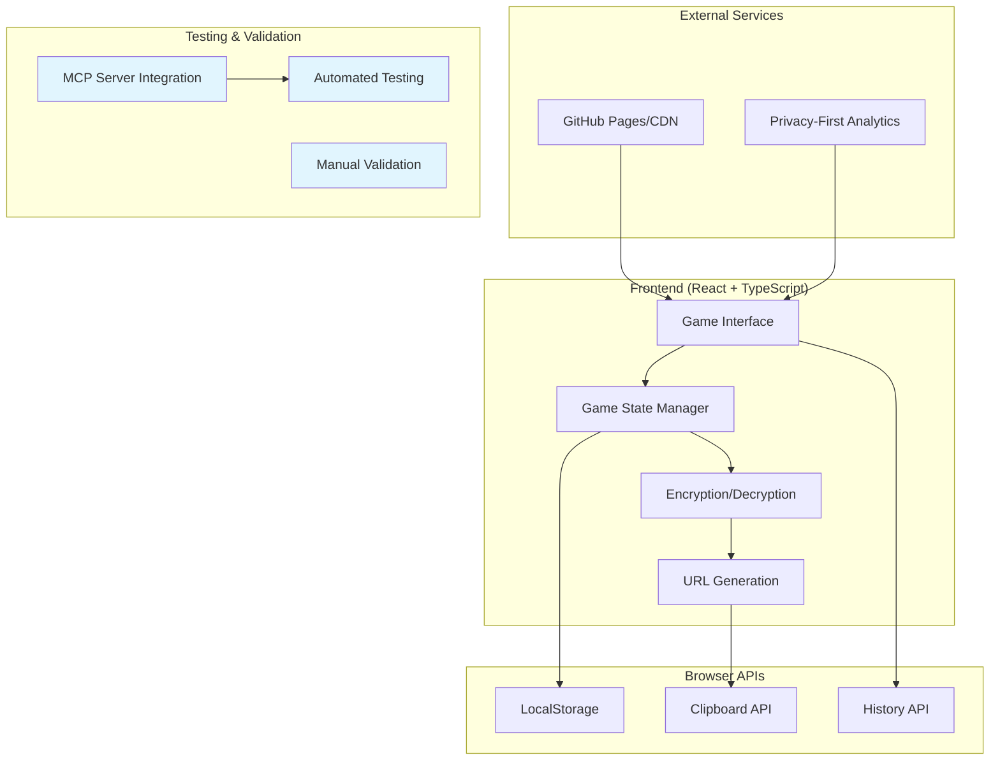
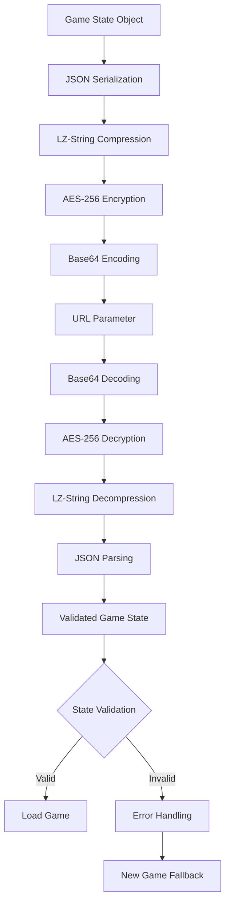
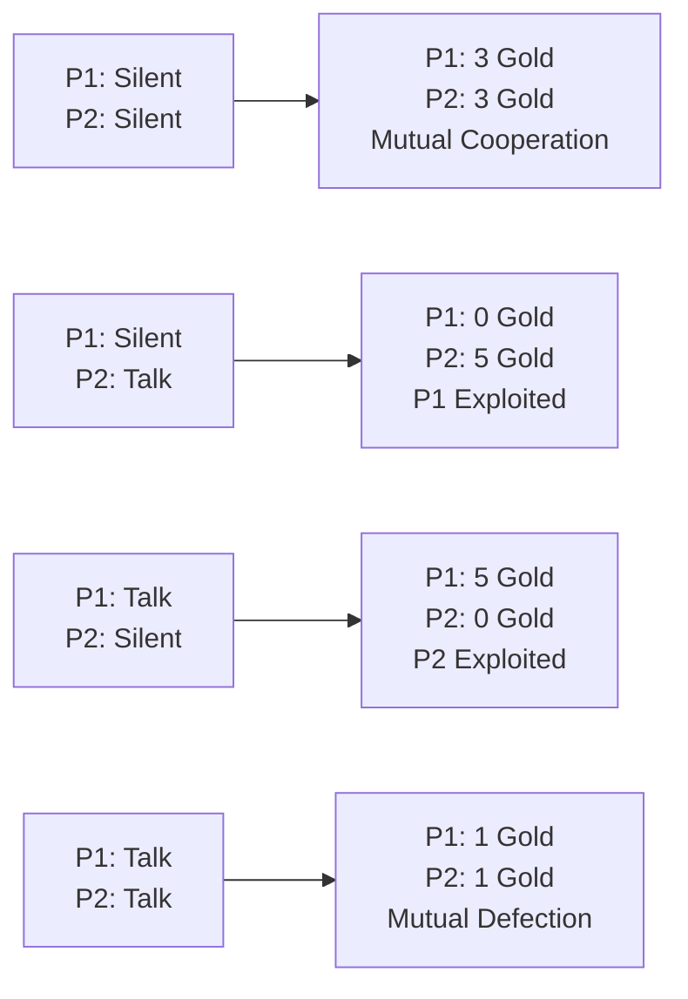
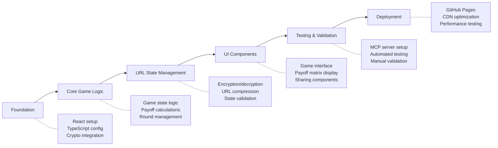

# Prisoner's Dilemma Correspondence Game - Product Requirements Document

## Executive Summary

### Problem Statement

Current web-based game theory demonstrations require complex server infrastructure, real-time coordination, and often lose the authentic tension of trust-building that makes the Prisoner's Dilemma psychologically engaging. Educational and entertainment implementations fail to capture the asynchronous nature of real strategic decision-making.

### Solution Overview

A serverless, URL-based Prisoner's Dilemma game that preserves encrypted game state in shareable URLs, enabling asynchronous play over any communication platform (email, text, Discord, etc.) without requiring servers, accounts, or real-time coordination. Players experience authentic game theory dynamics through a 5-round trust-building narrative.

### Success Metrics

- **Technical Performance**: URL length < 1500 characters, encryption/decryption < 100ms
- **User Experience**: Game completion rate > 80%, rematch rate > 40%
- **Educational Impact**: Clear understanding of cooperation vs. defection strategies
- **Platform Independence**: Works across all major browsers without server dependencies

---

## Market Analysis & Competitive Landscape

### Existing Solutions Analysis

**Educational Platforms (MobLab, Game Theory .net)**
- Strengths: Structured learning environment, data collection capabilities
- Weaknesses: Require accounts, server infrastructure, institutional access
- Limitations: Synchronous play requirements, limited social dynamics

**Simple Browser Games**
- Strengths: Easy access, immediate play
- Weaknesses: Lack educational depth, poor trust dynamics
- Limitations: No state persistence, limited replayability

**Blockchain-Based Games (Prisoners Dilemma .io)**
- Strengths: Decentralized, permanent records
- Weaknesses: Complex setup, transaction costs, crypto barriers
- Limitations: Limited accessibility, technical complexity

### Market Opportunity

**Underserved Segments:**
- Educators wanting simple game theory demonstrations
- Students needing accessible strategic decision-making practice
- Social groups wanting strategic party games
- Remote teams building trust and understanding cooperation dynamics

**Key Differentiators:**
1. **Zero Infrastructure**: No servers, databases, or accounts required
2. **Authentic Asynchronous Play**: Mirrors real-world strategic decision timing
3. **Universal Accessibility**: Works via any communication platform
4. **Privacy-First**: Encrypted state, no data collection
5. **Social Dynamics**: Comments and rematch chains build ongoing relationships

---

## User Stories & Scenarios

### Primary User Flow

```mermaid
graph LR
    A[Player 1 Starts Game] --> B[Makes Round 1 Choice]
    B --> C[Gets Shareable URL]
    C --> D[Shares URL via Any Platform]
    D --> E[Player 2 Opens URL]
    E --> F[Makes Round 1 Choice]
    F --> G[Sees Round 1 Results]
    G --> H[Makes Round 2 Choice]
    H --> I[Shares New URL]
    I --> J[Continue 5 Rounds]
    J --> K[Final Results & Messages]
    K --> L[Optional Rematch Chain]
```



### Core User Stories

#### Story 1: Game Initiation
**As an educator**, I want to quickly start a Prisoner's Dilemma game with a student so that we can explore cooperation strategies without complex setup.

**Acceptance Criteria:**
- [ ] Clear game premise and payoff matrix displayed
- [ ] Simple binary choice interface (Silent/Talk)
- [ ] Immediate URL generation after first choice
- [ ] No account creation or login required
- [ ] Game rules explained in under 30 seconds

**Edge Cases:**
- Invalid browser state (corrupted localStorage)
- Extremely long URL sharing (URL shortening needed)
- Player abandons game mid-setup

#### Story 2: Asynchronous Strategic Play
**As a player**, I want to make strategic decisions without time pressure so that I can genuinely consider trust and self-interest.

**Acceptance Criteria:**
- [ ] Choices remain hidden until both players decide
- [ ] Complete game history visible for strategic planning
- [ ] Payoff matrix always accessible for reference
- [ ] No time limits or pressure for decisions
- [ ] Previous round results inform future strategy

**Edge Cases:**
- One player never responds (game timeout handling)
- Players try to peek at opponent's choice
- Browser crashes mid-decision

#### Story 3: Trust Building Through Rounds
**As a friend playing with another friend**, I want our strategic choices to build a narrative so that the game creates meaningful social interaction.

**Acceptance Criteria:**
- [ ] Round-by-round results create cooperation/betrayal story
- [ ] Running totals show strategic outcomes
- [ ] Comments allow social interaction and explanation
- [ ] Rematch system enables ongoing strategic relationships
- [ ] Historical context influences future decisions

**Edge Cases:**
- Mismatched expectations about cooperation
- One player consistently defects
- Technical failures break game narrative

#### Story 4: Educational Understanding
**As a student**, I want to understand game theory concepts through hands-on experience so that abstract concepts become concrete.

**Acceptance Criteria:**
- [ ] Clear connection between choices and outcomes
- [ ] Visual payoff matrix prevents memorization requirements
- [ ] Strategy patterns emerge through repeated play
- [ ] Comments section allows reflection and discussion
- [ ] Different strategies yield different long-term outcomes

**Edge Cases:**
- Player doesn't understand Nash equilibrium
- Confusion about optimal vs. cooperative strategies
- Misunderstanding of game theory implications

---

## Technical Architecture

### High-Level Architecture



### Core System Components

#### URL State Management Engine


#### Game State Schema

```typescript
interface PrisonersDilemmaState {
  version: "1.0.0";
  gameId: string;                    // UUID for game identification

  players: {
    p1: PlayerInfo;                  // Player 1 metadata
    p2: PlayerInfo;                  // Player 2 metadata
  };

  rounds: Round[];                   // Array of 5 rounds
  currentRound: number;              // 0-4 (current round index)
  gamePhase: GamePhase;              // Current game state

  totals: {
    p1Gold: number;                  // Player 1 cumulative gold
    p2Gold: number;                  // Player 2 cumulative gold
  };

  metadata: {
    createdAt: string;               // ISO timestamp
    lastMoveAt: string;              // ISO timestamp
    turnCount: number;               // Total turns taken
  };

  socialFeatures: {
    finalMessage?: PlayerMessage;    // End-game comment
    rematchOffered?: boolean;        // Rematch flag
    rematchGameId?: string;          // Next game UUID
  };
}

interface PlayerInfo {
  id: string;                        // Anonymous player identifier
  name?: string;                     // Optional display name
  isActive: boolean;                 // Current turn indicator
}

interface Round {
  roundNumber: number;               // 1-5
  choices: {
    p1?: Choice;                     // undefined = not chosen yet
    p2?: Choice;                     // undefined = not chosen yet
  };
  results?: {
    p1Gold: number;                  // Gold earned this round
    p2Gold: number;                  // Gold earned this round
  };
  isComplete: boolean;               // Both players have chosen
  completedAt?: string;              // ISO timestamp
}

type Choice = "silent" | "talk";
type GamePhase = "setup" | "playing" | "finished";

interface PlayerMessage {
  from: "p1" | "p2";
  text: string;
  timestamp: string;
}
```

### Payoff Calculation Engine



### Security & Encryption

```typescript
// AES-256 encryption for game state
const GAME_SECRET = "prisoners-dilemma-2024-v1";

function encryptGameState(state: PrisonersDilemmaState): string {
  const json = JSON.stringify(state);
  const compressed = LZString.compress(json);
  const encrypted = CryptoJS.AES.encrypt(compressed, GAME_SECRET).toString();
  return btoa(encrypted);
}

function decryptGameState(encoded: string): PrisonersDilemmaState {
  const encrypted = atob(encoded);
  const decrypted = CryptoJS.AES.decrypt(encrypted, GAME_SECRET)
    .toString(CryptoJS.enc.Utf8);
  const json = LZString.decompress(decrypted);
  return PrisonersDilemmaStateSchema.parse(JSON.parse(json));
}
```

---

## Technology Stack & Implementation

### Frontend Architecture (React + TypeScript)

Based on analysis of `claude_md_files/CLAUDE-REACT.md`, implementing with strict TypeScript requirements:

```typescript
// Required TypeScript patterns for React 19
import { ReactElement, useState, useEffect } from 'react';

/**
 * Main game application component.
 *
 * Handles URL-based state loading, game phase management,
 * and routing between different game screens.
 */
function PrisonersDilemmaApp(): ReactElement {
  const [gameState, setGameState] = useState<PrisonersDilemmaState | null>(null);
  const [error, setError] = useState<string | null>(null);

  useEffect(() => {
    // Load game state from URL on mount
    loadGameFromURL().catch(setError);
  }, []);

  if (error) return <ErrorBoundary error={error} />;
  if (!gameState) return <NewGameSetup onGameCreated={setGameState} />;
  if (gameState.gamePhase === 'finished') return <GameResults gameState={gameState} />;

  return <GamePlay gameState={gameState} onStateUpdate={setGameState} />;
}
```

### Required Dependencies

```json
{
  "dependencies": {
    "react": "^19.0.0",
    "react-dom": "^19.0.0",
    "crypto-js": "^4.2.0",
    "lz-string": "^1.5.0",
    "zod": "^3.22.0"
  },
  "devDependencies": {
    "@types/crypto-js": "^4.2.0",
    "@types/react": "^19.0.0",
    "@types/react-dom": "^19.0.0",
    "vite": "^5.0.0",
    "typescript": "^5.3.0",
    "vitest": "^1.0.0",
    "@testing-library/react": "^14.0.0"
  }
}
```

### Build Configuration (Vite + GitHub Pages)

```typescript
// vite.config.ts
import { defineConfig } from 'vite'
import react from '@vitejs/plugin-react'

export default defineConfig({
  plugins: [react()],
  base: '/prisoners-dilemma/',
  build: {
    outDir: 'dist',
    sourcemap: true,
    rollupOptions: {
      output: {
        manualChunks: {
          "react-vendor": ["react", "react-dom"],
          "crypto-vendor": ["crypto-js", "lz-string"],
        },
      },
    },
  },
})
```

---

## MCP Integration for Testing

### Automated Testing Strategy

Based on research findings, implementing comprehensive MCP-powered testing:

```yaml
testing_architecture:
  unit_tests:
    - framework: Vitest
    - coverage: ">80% for all components"
    - validation: Zod schema testing

  integration_tests:
    - mcp_server: Playwright MCP
    - browser_automation: Chrome/Firefox support
    - accessibility: Axe-core integration

  end_to_end_tests:
    - mcp_server: Custom game flow MCP
    - game_scenarios: Complete 5-round flows
    - url_validation: Encryption/decryption cycles
```

### MCP Server Configuration

```typescript
// mcp-game-testing-server.ts
/**
 * Custom MCP server for Prisoner's Dilemma game testing.
 *
 * Provides AI-powered testing tools for game flow validation,
 * URL state integrity, and strategic scenario testing.
 */
import { MCPServer } from '@modelcontextprotocol/server';

const gameTestingServer = new MCPServer({
  name: "prisoners-dilemma-testing",
  version: "1.0.0",
  tools: [
    {
      name: "validate_game_flow",
      description: "Test complete 5-round game scenarios",
      parameters: {
        scenario: "cooperation | defection | mixed | random",
        playerCount: 2,
        assertOutcomes: true
      }
    },
    {
      name: "test_url_integrity",
      description: "Validate encryption/decryption cycles",
      parameters: {
        gameStates: "array of test game states",
        compressionTarget: "< 1500 characters"
      }
    },
    {
      name: "accessibility_scan",
      description: "Comprehensive accessibility testing",
      parameters: {
        wcagLevel: "AA",
        includeKeyboardNav: true,
        includeScreenReader: true
      }
    }
  ]
});
```

### Testing Integration with CI/CD

```yaml
# .github/workflows/test.yml
name: Comprehensive Game Testing

on: [push, pull_request]

jobs:
  test:
    runs-on: ubuntu-latest
    steps:
      - uses: actions/checkout@v4

      - name: Setup Node.js
        uses: actions/setup-node@v4
        with:
          node-version: '20'

      - name: Install dependencies
        run: npm ci

      - name: Run unit tests
        run: npm run test:coverage

      - name: Start MCP testing server
        run: npm run mcp:start

      - name: Run Playwright MCP tests
        run: npm run test:mcp:playwright

      - name: Run game flow validation
        run: npm run test:mcp:gameflow

      - name: Accessibility testing
        run: npm run test:mcp:accessibility
```

---

## Implementation Strategy

### Development Phases



### Phase 1: Foundation (Week 1)
**Priority: Critical Infrastructure**

- [ ] React 19 + TypeScript + Vite project setup
- [ ] Crypto-JS and LZ-String integration
- [ ] Basic game state schema with Zod validation
- [ ] URL encoding/decoding proof of concept
- [ ] Initial component structure

**Validation Gates:**
```bash
# Level 1: Foundation validation
npm run typecheck     # Zero TypeScript errors
npm run test:unit     # Basic state management tests
npm run build        # Successful production build
```

### Phase 2: Core Game Logic (Week 2)
**Priority: Business Logic Implementation**

- [ ] Complete game state management
- [ ] Payoff calculation engine
- [ ] Round progression logic
- [ ] Player turn management
- [ ] Win condition detection

**Validation Gates:**
```bash
# Level 2: Game logic validation
npm run test:game     # All game logic tests pass
npm run test:payoff   # Payoff calculation verification
npm run test:rounds   # 5-round progression testing
```

### Phase 3: URL State Management (Week 3)
**Priority: Core Differentiator**

- [ ] Complete encryption/decryption implementation
- [ ] URL compression optimization (< 1500 characters)
- [ ] State validation and error handling
- [ ] Browser compatibility testing
- [ ] Edge case handling (corrupted URLs, etc.)

**Validation Gates:**
```bash
# Level 3: URL state validation
npm run test:crypto      # Encryption/decryption cycles
npm run test:compression # URL length requirements
npm run test:browser     # Cross-browser compatibility
```

### Phase 4: UI Components (Week 4)
**Priority: User Experience**

- [ ] Game interface components
- [ ] Payoff matrix visualization
- [ ] URL sharing interface
- [ ] Game history display
- [ ] Results and messaging components

**Validation Gates:**
```bash
# Level 4: UI validation
npm run test:components  # Component behavior tests
npm run test:ui         # User interaction testing
npm run test:a11y       # Accessibility compliance
```

### Phase 5: Testing & Validation (Week 5)
**Priority: Quality Assurance**

- [ ] MCP testing server setup
- [ ] Comprehensive end-to-end testing
- [ ] Performance optimization
- [ ] Security validation
- [ ] User acceptance testing

**Validation Gates:**
```bash
# Level 5: Complete system validation
npm run test:mcp        # MCP-powered testing suite
npm run test:e2e        # End-to-end game flows
npm run test:security   # Security audit
npm run test:performance # Performance benchmarks
```

### Phase 6: Deployment (Week 6)
**Priority: Production Readiness**

- [ ] GitHub Pages configuration
- [ ] CI/CD pipeline setup
- [ ] Performance monitoring
- [ ] Documentation completion
- [ ] Launch preparation

**Validation Gates:**
```bash
# Level 6: Deployment validation
npm run build:prod      # Production build optimization
npm run deploy:test     # Staging deployment test
npm run monitor:perf    # Performance monitoring setup
```

---

## API Specifications

### URL Structure

```
https://username.github.io/prisoners-dilemma/?s=<base64_encrypted_state>

Query Parameters:
- s: Base64-encoded encrypted game state (required)
- v: Game version for compatibility checking (optional)
- debug: Enable debug mode for development (optional)
```

### State Validation API

```typescript
// Zod schemas for runtime validation
const PrisonersDilemmaStateSchema = z.object({
  version: z.literal("1.0.0"),
  gameId: z.string().uuid(),
  players: z.object({
    p1: PlayerInfoSchema,
    p2: PlayerInfoSchema,
  }),
  rounds: z.array(RoundSchema).length(5),
  currentRound: z.number().min(0).max(4),
  gamePhase: z.enum(["setup", "playing", "finished"]),
  totals: z.object({
    p1Gold: z.number().min(0),
    p2Gold: z.number().min(0),
  }),
  metadata: GameMetadataSchema,
  socialFeatures: SocialFeaturesSchema.optional(),
});

// Validation function
function validateGameState(data: unknown): PrisonersDilemmaState {
  return PrisonersDilemmaStateSchema.parse(data);
}
```

### Game Action API

```typescript
interface GameActions {
  // Player makes a choice for current round
  makeChoice(playerId: string, choice: Choice): Promise<PrisonersDilemmaState>;

  // Calculate results when both players have chosen
  calculateRoundResults(round: Round): Promise<Round>;

  // Progress to next round or finish game
  advanceGame(state: PrisonersDilemmaState): Promise<PrisonersDilemmaState>;

  // Add final message and offer rematch
  finishGame(message?: string, offerRematch?: boolean): Promise<PrisonersDilemmaState>;

  // Generate shareable URL for current state
  generateShareableURL(state: PrisonersDilemmaState): Promise<string>;
}
```

---

## Risk Assessment & Mitigation

### Technical Risks

#### High Priority Risks

**Risk: URL Length Exceeds Browser Limits**
- *Impact*: Game state cannot be shared, breaking core functionality
- *Probability*: Medium (varies by browser and data size)
- *Mitigation*:
  - Implement aggressive compression with LZ-String
  - Use shortened property names in state schema
  - Provide URL shortening service fallback
  - Monitor URL length during development
- *Validation*: Test with maximum game state across all major browsers

**Risk: Encryption/Decryption Performance**
- *Impact*: Poor user experience, especially on mobile devices
- *Probability*: Low (modern crypto APIs are fast)
- *Mitigation*:
  - Use Web Crypto API where available
  - Implement async encryption to prevent UI blocking
  - Add loading states for crypto operations
  - Performance monitoring and optimization
- *Validation*: Benchmark on minimum viable device specs

**Risk: State Corruption or Manipulation**
- *Impact*: Game integrity compromised, invalid states crash application
- *Probability*: Medium (users may share corrupted URLs)
- *Mitigation*:
  - Comprehensive Zod validation for all state
  - Graceful error handling for invalid states
  - Fallback to new game creation
  - State versioning for backward compatibility
- *Validation*: Fuzz testing with corrupted URLs

#### Medium Priority Risks

**Risk: Browser Compatibility Issues**
- *Impact*: Game doesn't work on some browsers/devices
- *Probability*: Low (using standard web APIs)
- *Mitigation*:
  - Polyfills for older browsers
  - Progressive enhancement approach
  - Comprehensive browser testing via MCP
  - Graceful degradation strategies
- *Validation*: Cross-browser testing with Playwright MCP

**Risk: Game State Size Growth**
- *Impact*: URLs become unwieldy over time
- *Probability*: Low (5 rounds is finite)
- *Mitigation*:
  - Minimal state schema design
  - Compression optimization
  - Remove unnecessary metadata
  - State pruning for old games
- *Validation*: Monitor state size across game progression

### Business Risks

**Risk: Low User Adoption**
- *Impact*: Game doesn't fulfill educational/entertainment goals
- *Probability*: Medium (novel interaction pattern)
- *Mitigation*:
  - Clear onboarding and instructions
  - Multiple sharing options (QR codes, shortened URLs)
  - Educational content about game theory
  - Viral sharing mechanics (rematch chains)
- *Validation*: User testing with target demographics

**Risk: Limited Educational Value**
- *Impact*: Fails to teach game theory concepts effectively
- *Probability*: Low (prisoner's dilemma is well-understood)
- *Mitigation*:
  - Clear visual feedback on strategy outcomes
  - Educational tooltips and explanations
  - Strategy analysis after game completion
  - Links to additional learning resources
- *Validation*: Testing with educators and students

### Security Risks

**Risk: Sensitive Information Exposure**
- *Impact*: Player privacy compromised
- *Probability*: Low (minimal data collection)
- *Mitigation*:
  - No personal data in game state
  - Optional player names only
  - Strong encryption for all shared data
  - No server-side data storage
- *Validation*: Security audit of data handling

---

## Success Criteria & Measurable Outcomes

### Technical Success Metrics

**Performance Benchmarks:**
- URL encoding/decoding: < 100ms on average devices
- Complete game state: < 1500 characters when encoded
- Cross-browser compatibility: 100% success rate on Chrome, Firefox, Safari, Edge
- Mobile responsiveness: Functional on devices with 360px width

**Reliability Metrics:**
- State integrity: 100% success rate for valid URLs
- Error handling: Graceful degradation for 100% of invalid inputs
- Encryption security: AES-256 with no known vulnerabilities
- Test coverage: Minimum 80% code coverage with comprehensive MCP testing

### User Experience Success Metrics

**Usability Benchmarks:**
- Game completion rate: > 80% of started games reach round 5
- Rematch engagement: > 40% of completed games result in rematch offers
- URL sharing success: > 95% of generated URLs load correctly
- Learning effectiveness: Users demonstrate understanding of cooperation vs. defection trade-offs

**Engagement Metrics:**
- Average game chain length: > 2 games per initial session
- Social sharing: Users share results or invite new players
- Educational adoption: Positive feedback from educators and students
- Accessibility compliance: WCAG 2.1 AA standard achievement

### Definition of Done

**Technical Requirements:**
- [ ] All user stories implemented with acceptance criteria met
- [ ] Minimum 80% test coverage across unit, integration, and e2e tests
- [ ] All MCP validation gates passed
- [ ] Zero TypeScript errors and ESLint warnings
- [ ] Performance benchmarks met on target devices
- [ ] Security review passed with no critical vulnerabilities
- [ ] Cross-browser compatibility verified
- [ ] Accessibility audit passed (WCAG 2.1 AA)

**User Experience Requirements:**
- [ ] Complete game flow tested with real users
- [ ] Educational value validated with target educators
- [ ] Onboarding process tested for clarity
- [ ] Error states provide helpful guidance
- [ ] Mobile experience optimized
- [ ] Social features encourage continued engagement

**Documentation Requirements:**
- [ ] Technical documentation complete
- [ ] User guide and educational materials created
- [ ] API documentation for future extensions
- [ ] Deployment and maintenance procedures documented
- [ ] Performance monitoring setup complete

---

## Appendices

### Appendix A: Game Theory Educational Context

**Learning Objectives:**
- Understand the tension between individual and collective rationality
- Experience the role of trust in strategic interactions
- Recognize real-world applications of game theory
- Develop strategic thinking skills

**Pedagogical Approach:**
- Learning through authentic experience rather than abstract explanation
- Social interaction creates emotional investment in outcomes
- Repeated play allows strategy evolution and learning
- Discussion prompts help reflection on strategic decisions

### Appendix B: Technical Implementation Details

**Encryption Specification:**
```javascript
// AES-256-CBC encryption with PBKDF2 key derivation
const keyDerivation = {
  algorithm: 'PBKDF2',
  hash: 'SHA-256',
  iterations: 100000,
  saltLength: 16
};

const encryption = {
  algorithm: 'AES-GCM',
  keyLength: 256,
  ivLength: 12,
  tagLength: 16
};
```

**Compression Strategy:**
```javascript
// Optimized state representation for compression
const stateOptimization = {
  propertyNames: {
    // Use single characters for frequently repeated properties
    'player1': 'p1',
    'player2': 'p2',
    'currentRound': 'cr',
    'gamePhase': 'gp',
    'isComplete': 'ic'
  },
  enumValues: {
    // Use numbers instead of strings for enums
    'silent': 0,
    'talk': 1,
    'setup': 0,
    'playing': 1,
    'finished': 2
  }
};
```

### Appendix C: MCP Testing Scenarios

**Comprehensive Test Coverage:**

1. **Game Flow Tests**
   - All cooperation scenario (5 rounds of mutual silent)
   - All defection scenario (5 rounds of mutual talk)
   - Mixed strategy scenarios (various combinations)
   - Single player abandonment scenarios
   - Invalid choice handling

2. **URL State Tests**
   - Round-trip encryption/decryption integrity
   - Maximum state size validation
   - Corrupted URL handling
   - Version compatibility checking
   - Cross-browser URL handling

3. **Accessibility Tests**
   - Screen reader compatibility
   - Keyboard navigation
   - Color contrast compliance
   - Focus management
   - ARIA label verification

### Appendix D: Future Enhancement Opportunities

**Post-MVP Features:**
- Tournament mode with multiple game tracking
- Strategy analysis and recommendations
- Different payoff matrices for game variations
- Anonymous vs. named player modes
- Game replay and analysis tools
- Integration with learning management systems
- Mobile app versions
- Multi-language support

**Technical Extensions:**
- WebRTC direct connection for real-time play option
- Progressive Web App (PWA) capabilities
- Offline play with sync when online
- Advanced analytics dashboard
- API for educational platform integration

---

## Document Control

**Version:** 1.0
**Created:** December 2024
**Last Updated:** December 2024
**Next Review:** After Phase 3 completion

**Stakeholders:**
- Product Owner: Ryan (PRP Framework Lead)
- Technical Lead: Claude Code Agent
- Educational Consultant: Game Theory Educator (TBD)
- UX Reviewer: User Experience Designer (TBD)

**Approval Status:**
- [ ] Technical Architecture Approved
- [ ] Business Requirements Approved
- [ ] Risk Assessment Reviewed
- [ ] Success Criteria Validated
- [ ] Ready for Implementation

---

*This PRD serves as the comprehensive specification for implementing a serverless, URL-based Prisoner's Dilemma game that demonstrates advanced game theory concepts through authentic strategic interaction, leveraging the correspondence pattern for maximum accessibility and educational impact.*