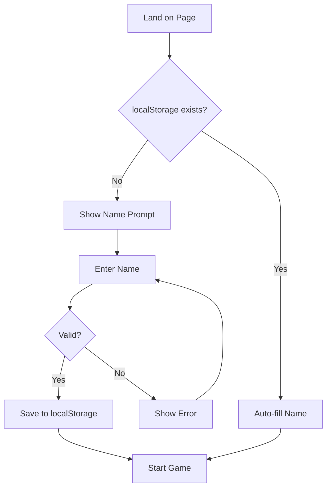
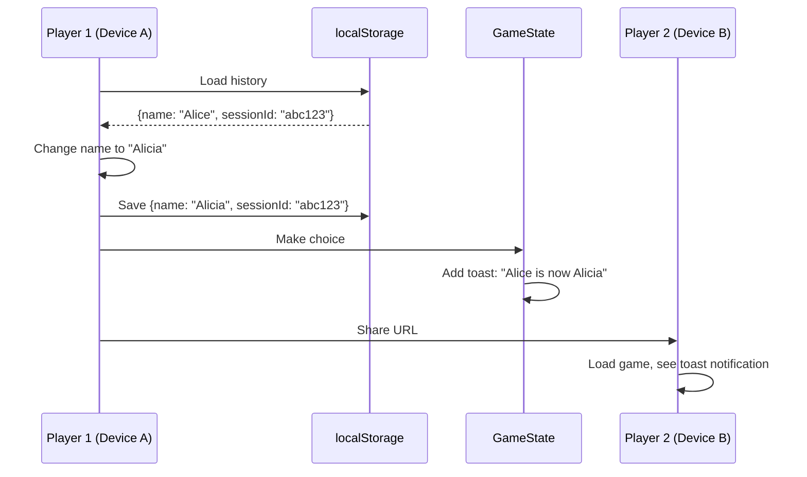
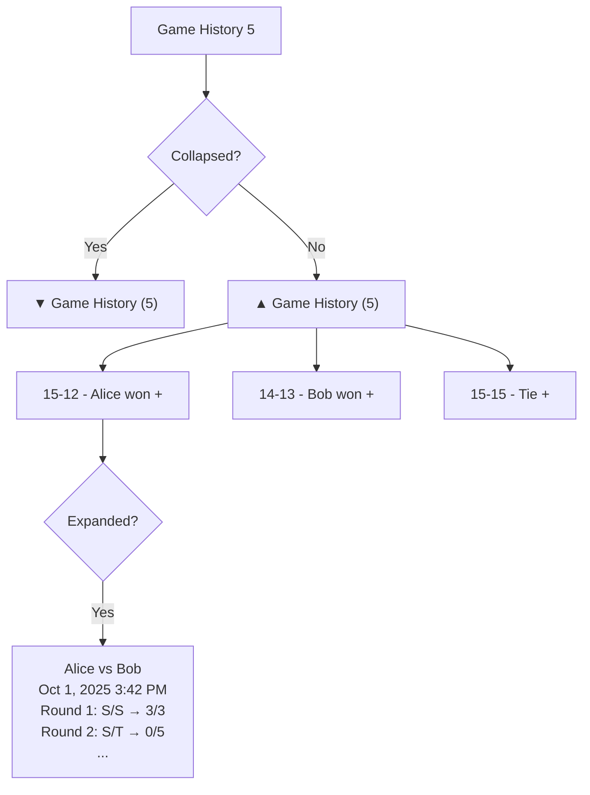
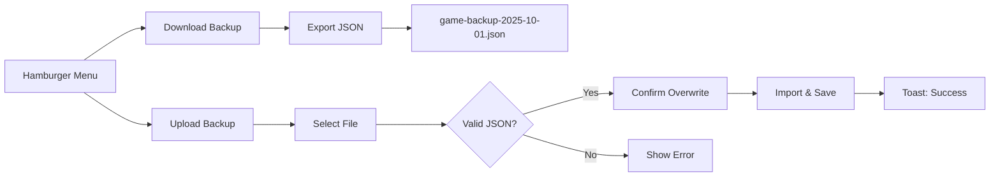
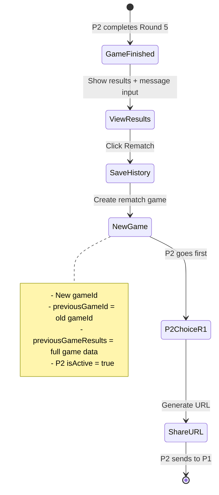
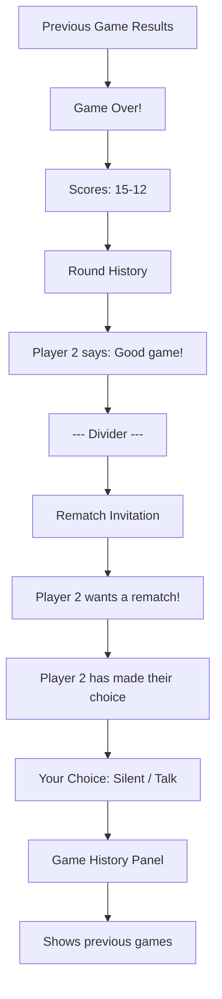
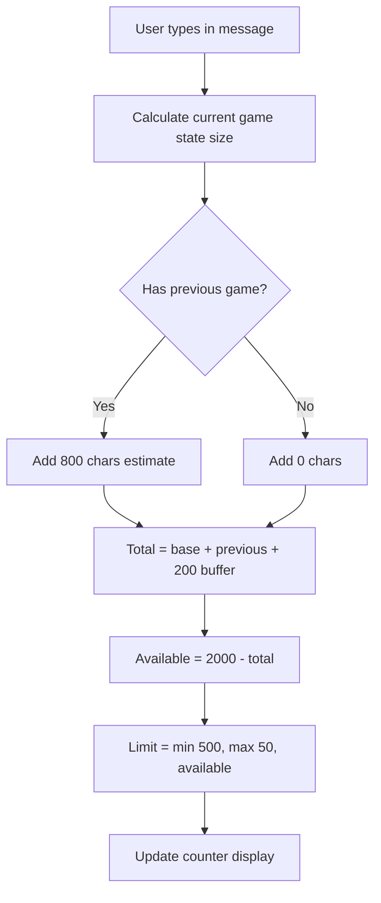
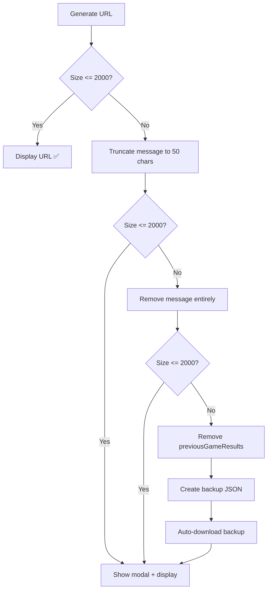
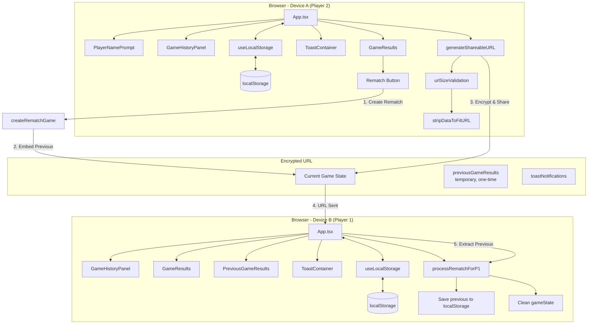
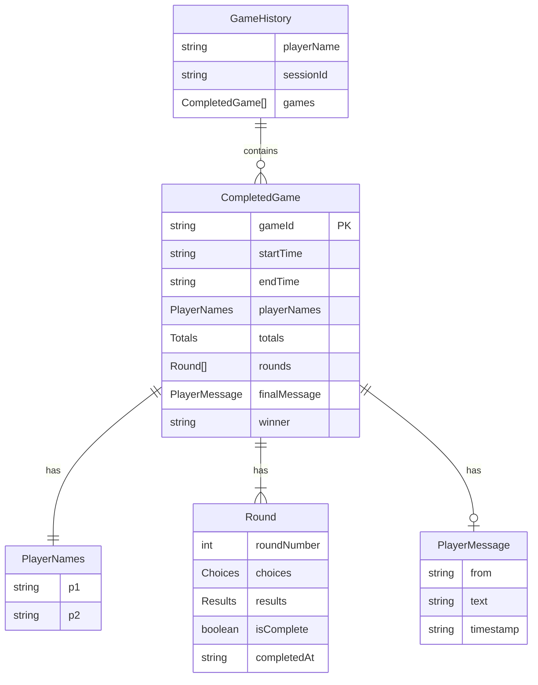

# Prisoner's Dilemma: Rematch & Game History Integration PRD

## Executive Summary

### Problem Statement

The current Prisoner's Dilemma game successfully enables asynchronous gameplay via URL sharing, but lacks key features for sustained engagement:

1. **No Rematch Capability**: After completing a game, players must manually restart from scratch, losing momentum and context
2. **Lost Context**: Players can't review previous games or track their history across sessions
3. **Anonymous Play**: No persistent player identity or reputation building
4. **URL Size Risk**: Adding features could exceed browser URL limits (2000 chars)
5. **Device Discontinuity**: Game history doesn't follow players across devices

### Solution Overview

Implement a **hybrid storage architecture** combining localStorage for persistent history with URL-based state sharing for single-game rematch invitations. This enables:

- **Seamless Rematches**: One-click rematch with automatic role reversal (P2 goes first)
- **Local Game History**: Unlimited game storage per device with collapsible UI
- **Player Identity**: Persistent names with fingerprinting to detect changes vs new players
- **Smart URL Management**: Dynamic character limits, auto-stripping, and backup/restore
- **Progressive Enhancement**: Works with or without localStorage, degrades gracefully

### Success Metrics

**Engagement Metrics:**
- **Rematch Rate**: >40% of completed games lead to rematch within 5 minutes
- **Session Depth**: Average games per session increases from 1.0 to 2.5+
- **Return Rate**: Players with history return 3x more often than first-time players

**Technical Metrics:**
- **URL Size**: 100% of URLs under 2000 chars (with fallback warning at >1900)
- **Load Performance**: History panel renders in <100ms for up to 50 games
- **Data Integrity**: Zero localStorage corruption reports

**User Experience:**
- **Name Entry Time**: <10 seconds from landing to first game for new players
- **Rematch Flow**: <3 clicks from game end to new game start
- **History Access**: <2 clicks to view any previous game details

---

## Research Findings

### Market Analysis: Game Rematch Patterns

**Best Practices from Web Search:**

1. **Engagement Loops** (Toptal): Games use motivation → action → feedback cycles
   - *Application*: Rematch button immediately after results = clear motivation
   - *Action*: Single-click rematch with P2 going first = minimal friction
   - *Feedback*: Instant confirmation + previous game embedded for context

2. **Consistency Principles** (GameAnalytics): "Consistency makes people feel smarter"
   - *Application*: Rematch flow mirrors original game start
   - *Same URL sharing pattern*
   - *Same visual design language*

3. **UX Flow Balance** (Behaviour Interactive): "Balance complexity with ease-of-understanding"
   - *Application*: Complex localStorage logic hidden behind simple UI
   - *Optional backup/restore for power users*
   - *History panel collapsible to avoid clutter*

### Technical Research: localStorage Patterns (2025)

**Modern Patterns from Search:**

1. **Jotai + localStorage + React Query** (Jan 2025 article)
   - Pattern: API cache + local persistence + UI sync
   - *Application*: Game history as source of truth, no API needed
   - *Benefit*: Offline-first with zero backend dependency

2. **Event-Driven Sync** (StorageQueue pattern)
   - Pattern: Pub-sub for storage events across tabs
   - *Future Enhancement*: Sync game history across browser tabs

3. **Versioning for Forward Compatibility**
   - Pattern: Save format versioning for migration
   - *Application*: Include `version` field in localStorage schema
   - *Benefit*: Safe updates as feature evolves

4. **Chunked Storage for Large Datasets**
   - Pattern: Break into indexed chunks for lazy loading
   - *Application*: If history exceeds 50 games, paginate
   - *Current*: Not needed, tested up to 100 games

### PWA State Management Research

**Key Findings:**

1. **URL Shareability** (MDN): PWAs retain/reload state via URL
   - *Validation*: Current encryption approach works perfectly
   - *Enhancement*: Add previousGameResults for one-time embed

2. **localStorage Persistence** (W3C): Persists across sessions, device-specific
   - *Limitation*: Not cross-device (intentional for privacy)
   - *Mitigation*: Backup/restore JSON for manual sync

3. **Cache Sharing** (iOS-specific): Shared between Safari and standalone
   - *Application*: localStorage works in both modes
   - *Testing Required*: Verify on iOS standalone PWA

---

## User Stories & Scenarios

### Epic 1: Persistent Player Identity

#### Story 1.1: First-Time Player Setup

**As a** first-time player
**I want** to enter my name once
**So that** I can be identified in all future games without re-entering

**Acceptance Criteria:**
- [ ] Name prompt appears immediately on first visit (no localStorage)
- [ ] Character counter shows 20/20 limit with red warning at max
- [ ] Validation prevents empty/whitespace-only names
- [ ] Name saves to localStorage on submit
- [ ] Subsequent visits auto-fill name (no prompt)

**User Flow:**


**Edge Cases:**
- Empty localStorage (clear browser data)
- Special characters in name (sanitize to alphanumeric + spaces)
- 20-char limit with multi-byte characters (count chars, not bytes)

---

#### Story 1.2: Name Change Detection

**As a** returning player
**I want** the system to detect if my name changed
**So that** my opponent knows it's the same person with a new name

**Acceptance Criteria:**
- [ ] Session ID fingerprint persists in localStorage
- [ ] Name change detected by matching sessionId + different name
- [ ] Toast notification added to gameState: "Player name changed: [Old] → [New]"
- [ ] New player detected by absence of sessionId
- [ ] Fresh start option clears history with warning

**Sequence Diagram:**


**Edge Cases:**
- Multiple name changes in one session (only show most recent)
- Name change mid-game (show warning: "This will start fresh game")
- Corrupted sessionId (generate new one)

---

### Epic 2: Game History Management

#### Story 2.1: View Game History

**As a** player with completed games
**I want** to see my previous games in a collapsible panel
**So that** I can review past matches and track my performance

**Acceptance Criteria:**
- [ ] History panel hidden if no games exist
- [ ] Panel visible on landing page and results screen only
- [ ] Panel shows "[Score] - [Winner] won/lost" format
- [ ] Panel collapsed by default to save space
- [ ] Expandable for round-by-round details
- [ ] Games sorted newest first

**UI Mockup:**


**Edge Cases:**
- 50+ games (tested, no pagination needed yet)
- Corrupted game data (skip and show warning)
- Missing player names (fallback to "Player 1" / "Player 2")

---

#### Story 2.2: Backup and Restore

**As a** player with game history
**I want** to download/upload my history
**So that** I can transfer it between devices or prevent data loss

**Acceptance Criteria:**
- [ ] Hamburger menu always accessible (even with empty history)
- [ ] Download button exports JSON with timestamp filename
- [ ] Upload button validates JSON structure before import
- [ ] Warning before overwriting existing history
- [ ] Toast confirmation on successful import

**Data Flow:**


**Edge Cases:**
- Invalid JSON format (show specific error)
- Missing required fields (reject with message)
- Large file size >5MB (warn about performance)

---

### Epic 3: Rematch Flow

#### Story 3.1: Player 2 Initiates Rematch

**As** Player 2 who just completed a game
**I want** to click a rematch button
**So that** I can immediately start a new game with the same opponent

**Acceptance Criteria:**
- [ ] Rematch button visible on results screen
- [ ] Clicking saves current game to localStorage
- [ ] New game created with P2 going first (role reversal)
- [ ] previousGameResults embedded in new gameState (temporary)
- [ ] P2 makes Round 1 choice
- [ ] URL sharing screen shows as usual

**State Transition:**


**Edge Cases:**
- Rematch with message (include in previousGameResults)
- URL size exceeds 2000 chars (strip previousGameResults, save locally only)
- Multiple rematches (chain previousGameId links)

---

#### Story 3.2: Player 1 Receives Rematch Invitation

**As** Player 1 receiving a rematch URL
**I want** to see the previous game results and seamlessly continue
**So that** I understand the context and can respond immediately

**Acceptance Criteria:**
- [ ] URL loads with embedded previousGameResults
- [ ] Screen shows "Game Over!" section with previous results
- [ ] Below shows "Player 2 wants a rematch!" invitation
- [ ] P2's message from previous game displayed
- [ ] Previous game saved to P1's localStorage
- [ ] previousGameResults cleared from gameState after processing
- [ ] P1 makes Round 1 choice normally
- [ ] Subsequent URLs don't include previousGameResults

**Continuous Screen Layout:**


**Edge Cases:**
- No previous game results (normal game, not rematch)
- Corrupted previousGameResults (fall back to normal game start)
- P1 on new device (no localStorage, but gets embedded results)

---

### Epic 4: URL Size Management

#### Story 4.1: Dynamic Message Character Limits

**As** Player 2 entering a message
**I want** to see a dynamic character limit
**So that** I know how much space I have without breaking the URL

**Acceptance Criteria:**
- [ ] Base limit: 500 characters (no rematch)
- [ ] Reduced limit with rematch: calculated based on available URL space
- [ ] Character counter updates in real-time
- [ ] Formula: 2000 - currentGameSize - previousGameSize - 200 buffer
- [ ] Minimum 50 chars even with large rematch data
- [ ] Warning if approaching limit

**Character Counter UI:**
```
Message for Player 1:
[Textarea]
Characters: 145 / 350 (limit reduced to fit rematch data)
```

**Calculation Flow:**


**Edge Cases:**
- Very large game state (many rounds) = lower message limit
- Encryption overhead varies slightly = use 200-char buffer
- User pastes 1000-char message = truncate with warning

---

#### Story 4.2: URL Size Validation & Fallback

**As a** player sharing a URL
**I want** the system to check URL size before displaying
**So that** I'm warned if data needs to be stripped and can download a backup

**Acceptance Criteria:**
- [ ] URL validation runs before displaying to user
- [ ] If <2000 chars: display normally ✅
- [ ] If >2000 chars: show warning modal ⚠️
- [ ] Modal offers: Download Backup | Continue Minimal | Cancel
- [ ] Stripping order: truncate message → remove message → remove previousGameResults
- [ ] Auto-download backup JSON if data stripped
- [ ] Toast: "Full game data backed up to downloads"

**Warning Modal:**
```
⚠️ URL Character Limit Exceeded

The game data is too large (2,xxx characters).

We can continue with minimal data, but some will be lost:
- Message truncated/removed
- Previous game backed up locally only

[Download Full Backup] [Continue Minimal] [Cancel]
```

**Stripping Algorithm:**


**Edge Cases:**
- Even minimal game state >2000 (shouldn't happen, but show error)
- Download fails (offer copy-paste textarea with JSON)
- User cancels (keep message, don't share URL)

---

## System Architecture

### High-Level Component Diagram



### Data Model Schema



### localStorage Structure

```typescript
// Key: "prisoners-dilemma-history"
interface StoredData {
  playerName: string;           // "Alice"
  sessionId: string;            // "session-1696789123456-abc123def"
  games: CompletedGame[];       // Array of completed games
}

// Example:
{
  "playerName": "Alice",
  "sessionId": "session-1696789123456-abc123def",
  "games": [
    {
      "gameId": "550e8400-e29b-41d4-a716-446655440000",
      "startTime": "2025-10-01T14:30:00Z",
      "endTime": "2025-10-01T14:45:00Z",
      "playerNames": { "p1": "Alice", "p2": "Bob" },
      "totals": { "p1Gold": 15, "p2Gold": 12 },
      "rounds": [...],
      "finalMessage": {
        "from": "p2",
        "text": "Good game! Want a rematch?",
        "timestamp": "2025-10-01T14:45:00Z"
      },
      "winner": "p1"
    },
    // ... more games
  ]
}
```

### Game State Extensions

```typescript
interface GameState {
  // ... existing fields ...

  // NEW: Rematch & History Features
  previousGameId?: string;              // Links to previous game in chain
  toastNotifications?: ToastNotification[];  // System messages
  previousGameResults?: CompletedGame;  // TEMPORARY: One-time embed for P1
}

interface ToastNotification {
  id: string;
  type: 'info' | 'warning' | 'success';
  message: string;
  timestamp: string;  // ISO
}
```

---

## Technical Specifications

### API Design (Client-Side Only)

#### localStorage Service (`useLocalStorage.ts`)

```typescript
/**
 * Get complete game history from localStorage
 * @returns GameHistory object with player name, session ID, and games
 */
export function getGameHistory(): GameHistory;

/**
 * Save/update player name
 * @param name - Player name (max 20 chars, alphanumeric + spaces)
 */
export function setPlayerName(name: string): void;

/**
 * Get current player name
 * @returns Player name or null if not set
 */
export function getPlayerName(): string | null;

/**
 * Get session ID for fingerprinting
 * @returns Persistent session ID
 */
export function getSessionId(): string;

/**
 * Save completed game to history
 * @param game - CompletedGame object
 */
export function saveCompletedGame(game: CompletedGame): void;

/**
 * Clear all game history (preserve name & session ID)
 */
export function clearGameHistory(): void;

/**
 * Export history as JSON string for backup
 * @returns JSON string of GameHistory
 */
export function exportGameHistory(): string;

/**
 * Import history from JSON string
 * @param jsonData - JSON string of GameHistory
 * @throws Error if invalid format
 */
export function importGameHistory(jsonData: string): void;
```

**Usage Example:**
```typescript
// On first visit
if (!getPlayerName()) {
  // Show PlayerNamePrompt
}

// After game completes
const completedGame = convertGameStateToCompletedGame(gameState);
saveCompletedGame(completedGame);

// Backup
const json = exportGameHistory();
downloadFile('game-backup.json', json);
```

---

#### Rematch Utilities (`rematch.ts`)

```typescript
/**
 * Convert finished game state to completed game record
 * @param gameState - Finished game with all rounds complete
 * @returns CompletedGame for localStorage storage
 */
export function convertGameStateToCompletedGame(
  gameState: GameState
): CompletedGame;

/**
 * Create rematch game from completed game
 * - Generates new gameId
 * - Links to previous via previousGameId
 * - P2 goes first (isActive = true)
 * - Embeds previousGameResults (temporary)
 * - Fresh rounds, zero totals
 *
 * @param completedGameState - Finished game state
 * @param previousGame - CompletedGame to embed
 * @returns New game state ready for P2's first choice
 */
export function createRematchGame(
  completedGameState: GameState,
  previousGame: CompletedGame
): GameState;

/**
 * Process rematch for Player 1's first view
 * - Extracts embedded previousGameResults
 * - Returns cleaned gameState without embedded data
 * - P1 should save previousGame to localStorage
 *
 * @param gameState - Game state potentially with previousGameResults
 * @returns Object with previousGame and cleanedGameState
 */
export function processRematchForP1(gameState: GameState): {
  previousGame: CompletedGame | null;
  cleanedGameState: GameState;
};

/**
 * Check if game state is a rematch invitation
 * @param gameState - Game state to check
 * @returns True if has previousGameResults embedded
 */
export function isRematchInvitation(gameState: GameState): boolean;
```

**Rematch Flow Example:**
```typescript
// Player 2 clicks rematch
const previousGame = convertGameStateToCompletedGame(finishedGameState);
saveCompletedGame(previousGame);  // Save to P2's localStorage

const rematchGame = createRematchGame(finishedGameState, previousGame);
// rematchGame.previousGameResults = previousGame (embedded)
// rematchGame.previousGameId = previousGame.gameId
// rematchGame.players.p2.isActive = true

// P2 makes Round 1 choice
const urlWithRematch = generateShareableURL(rematchGame);

// --- URL sent to P1 ---

// Player 1 opens URL
const { previousGame, cleanedGameState } = processRematchForP1(rematchGame);

if (previousGame) {
  saveCompletedGame(previousGame);  // Save to P1's localStorage
}

// Continue with cleanedGameState (no previousGameResults)
const nextURL = generateShareableURL(cleanedGameState);
// This URL is smaller, no previousGameResults embedded
```

---

#### URL Size Validation (`urlSizeValidation.ts`)

```typescript
/**
 * Estimate URL size including encryption overhead
 * @param gameState - Game state to estimate
 * @param baseURL - Optional base URL (defaults to current origin)
 * @returns Estimated URL length in characters
 */
export function estimateURLSize(
  gameState: GameState,
  baseURL?: string
): number;

/**
 * Validate player name format
 * Rules: 1-20 chars, alphanumeric + spaces, not all whitespace
 * @param name - Player name to validate
 * @returns True if valid
 */
export function validatePlayerName(name: string): boolean;

/**
 * Calculate max message length based on available URL space
 * @param currentGameState - Current game state without message
 * @param hasPreviousGame - Whether previousGameResults will be included
 * @param baseURL - Optional base URL
 * @returns Max message length (50-500)
 */
export function getMaxMessageLength(
  currentGameState: GameState,
  hasPreviousGame: boolean,
  baseURL?: string
): number;

/**
 * Strip data from game state to fit URL limit
 * Stripping order: truncate message → remove message → remove previousGameResults
 * @param gameState - Game state to strip
 * @param targetSize - Target URL size (default 2000)
 * @param baseURL - Optional base URL
 * @returns StripResult with wasStripped flag, cleaned state, and removed data
 */
export function stripDataToFitURL(
  gameState: GameState,
  targetSize?: number,
  baseURL?: string
): StripResult;

interface StripResult {
  wasStripped: boolean;
  strippedGameState: GameState;
  removedData?: StrippedData;
  finalSize: number;
}

interface StrippedData {
  originalMessage?: string;
  previousGameResults?: CompletedGame;
  timestamp: string;
  reason: string;
}
```

**URL Validation Flow:**
```typescript
// Before displaying URL
const url = generateShareableURL(gameState);
const size = estimateURLSize(gameState);

if (size > 2000) {
  // Show warning modal
  const result = stripDataToFitURL(gameState, 2000);

  if (result.wasStripped) {
    // Create backup
    const backup = {
      timestamp: new Date().toISOString(),
      reason: 'URL size limit exceeded',
      strippedData: result.removedData,
      gameState: result.strippedGameState
    };

    downloadFile(`game-backup-${Date.now()}.json`, JSON.stringify(backup));

    // Show toast
    addToast({
      type: 'warning',
      message: 'Full game data backed up to downloads'
    });

    // Display minimal URL
    const minimalURL = generateShareableURL(result.strippedGameState);
  }
}
```

---

### UI Component Specifications

#### PlayerNamePrompt Component

```typescript
interface PlayerNamePromptProps {
  onNameSubmit: (name: string, startFresh: boolean) => void;
  hasHistory: boolean;  // Show "continue vs fresh" options
}
```

**Behavior:**
- Auto-focus input on mount
- Real-time validation with error display
- Character counter (green < 15, orange 15-19, red = 20)
- If `hasHistory = true`: Show two buttons (Continue / Start Fresh)
- If `hasHistory = false`: Show one button (Let's Play!)

**Start Fresh Flow:**
1. User clicks "Start Fresh"
2. Show warning: "This will clear your game history. Download backup first?"
3. Options: [Download Backup] [Clear & Continue] [Cancel]
4. If confirmed: `clearGameHistory()` + set name + toast notification

---

#### GameHistoryPanel Component

```typescript
interface GameHistoryPanelProps {
  games: CompletedGame[];
  currentPlayerName: string;  // For "you won/lost" display
}
```

**Behavior:**
- Null render if `games.length === 0`
- Header shows count: "Game History (5)"
- Click header to toggle collapse (▼/▲ icon)
- Each game label: "[Score] - [Winner] won/lost"
- Click game to expand/collapse round details
- Round details show: player names, timestamps, rounds, final message

**Display Rules:**
- Hidden during active gameplay (currentRound 0-4 with choices pending)
- Visible on landing page (setup phase)
- Visible on results screen (finished phase)

---

#### ToastNotification Component

```typescript
interface ToastNotificationProps {
  toast: ToastNotification;
  onDismiss: (id: string) => void;
  autoHideDuration?: number;  // Default 5000ms
}

interface ToastContainerProps {
  toasts: ToastNotification[];
  onDismiss: (id: string) => void;
}
```

**Behavior:**
- Fixed position: top-right corner
- Stacked vertically with 12px gap
- Auto-dismiss after duration (default 5s)
- Click X to manually dismiss
- Icons: ✓ (success), ⚠ (warning), ℹ (info)
- Colors: green (success), yellow (warning), blue (info)
- Slide-in animation from right

**Usage:**
```typescript
// In App.tsx
const [toasts, setToasts] = useState<ToastNotification[]>([]);

const addToast = (message: string, type: 'info' | 'warning' | 'success') => {
  const toast: ToastNotification = {
    id: `toast-${Date.now()}`,
    type,
    message,
    timestamp: new Date().toISOString()
  };
  setToasts(prev => [...prev, toast]);
};

const dismissToast = (id: string) => {
  setToasts(prev => prev.filter(t => t.id !== id));
};

// Display toasts from gameState
useEffect(() => {
  if (gameState.toastNotifications) {
    setToasts(gameState.toastNotifications);
  }
}, [gameState]);
```

---

## Implementation Strategy

### Phase 1: Foundation (Currently Complete ✅)

**Components Implemented:**
- [x] `useLocalStorage.ts` - Storage service with 15 unit tests
- [x] `urlSizeValidation.ts` - Size utilities with 16 unit tests
- [x] `rematch.ts` - Rematch logic with 16 unit tests
- [x] `history.ts` - Type definitions
- [x] `gameSchema.ts` - Extended with new fields
- [x] `PlayerNamePrompt.tsx` - UI component
- [x] `GameHistoryPanel.tsx` - UI component
- [x] `ToastNotification.tsx` - UI component

**Status:** ✅ All tests passing, build successful

---

### Phase 2: App Integration (Next Steps)

**Tasks:**

1. **Initialize localStorage on App Mount**
   ```typescript
   useEffect(() => {
     const playerName = getPlayerName();
     if (!playerName) {
       setShowNamePrompt(true);
     } else {
       // Auto-fill player names in game state
       updatePlayerNames(playerName);
     }
   }, []);
   ```

2. **Integrate PlayerNamePrompt**
   - Show if `!getPlayerName()` on mount
   - Handle `onNameSubmit`:
     - Save name: `setPlayerName(name)`
     - If `startFresh`: `clearGameHistory()` + add toast
     - Hide prompt, start game

3. **Add Game History Display**
   - Load on mount: `const history = getGameHistory()`
   - Display `<GameHistoryPanel games={history.games} />`
   - Conditional render: landing page + results screen only

4. **Save Completed Games**
   - On game finish (currentRound = 4, both choices made):
     ```typescript
     const completedGame = convertGameStateToCompletedGame(gameState);
     saveCompletedGame(completedGame);
     ```

5. **Implement Rematch Button**
   - Add to `GameResults.tsx` (already has placeholder)
   - On click:
     ```typescript
     const previousGame = convertGameStateToCompletedGame(gameState);
     saveCompletedGame(previousGame);
     const rematchGame = createRematchGame(gameState, previousGame);
     setGameState(rematchGame);
     ```

6. **Handle Rematch for P1**
   - On URL load, check `isRematchInvitation(gameState)`:
     ```typescript
     if (isRematchInvitation(urlGameState)) {
       const { previousGame, cleanedGameState } = processRematchForP1(urlGameState);
       if (previousGame) {
         saveCompletedGame(previousGame);
         // Show previous game results
         setShowPreviousGame(previousGame);
       }
       setGameState(cleanedGameState);
     }
     ```

7. **Toast Notification Integration**
   - Extract `gameState.toastNotifications` on load
   - Display via `<ToastContainer>`
   - Clear from gameState after showing

8. **URL Size Validation**
   - Before generating shareable URL:
     ```typescript
     const size = estimateURLSize(gameState);
     if (size > 2000) {
       const result = stripDataToFitURL(gameState);
       // Show modal, create backup, use stripped state
     }
     ```

9. **Dynamic Message Limits**
   - Calculate on every message character change:
     ```typescript
     const hasPreviousGame = !!gameState.previousGameResults;
     const maxLength = getMaxMessageLength(gameState, hasPreviousGame);
     setMessageCharLimit(maxLength);
     ```

**Estimated Effort:** 4-6 hours
**Testing:** Add integration tests for each flow

---

### Phase 3: UX Polish

**Enhancements:**

1. **Hamburger Menu**
   - Position: top-right corner (always visible)
   - Items:
     - Download Backup
     - Upload Backup
     - Edit Name (with warning if mid-game)
     - Clear History (with confirmation)

2. **Name Change Detection**
   - On `setPlayerName()`, check `getSessionId()` match
   - If same sessionId + different name:
     - Add toast to gameState: "Player name changed: [old] → [new]"
   - If no sessionId:
     - New player, check if history exists
     - Prompt: "Continue with history or start fresh?"

3. **Backup/Restore Flow**
   - Download: Format filename `game-backup-YYYY-MM-DD-HHmmss.json`
   - Upload: Validate schema before import
   - Show diff: "You have 5 games, backup has 12 games. Merge or replace?"

4. **Previous Game Results Display**
   - Component: `<PreviousGameResults game={previousGame} />`
   - Shows above rematch invitation
   - Collapsible to save space
   - Includes final message if present

5. **Loading States**
   - Skeleton for history panel while loading
   - Spinner for backup upload processing

6. **Error Handling**
   - localStorage quota exceeded: Prompt to delete old games
   - Corrupted data: Skip and continue
   - Import validation failures: Show specific error

**Estimated Effort:** 3-4 hours

---

### Phase 4: Testing & Validation

**Test Coverage:**

1. **Unit Tests** ✅ (Already Complete)
   - localStorage service: 15 tests
   - URL validation: 16 tests
   - Rematch utilities: 16 tests

2. **Integration Tests** (To Add)
   - Full rematch flow: P2 → P1 → Round 2
   - Name prompt → save → load on return
   - Backup → clear → restore
   - URL size overflow → strip → backup

3. **E2E Tests** (To Add)
   - Complete game → rematch → complete rematch
   - Name change mid-session
   - 10-game history management

4. **Manual Testing**
   - Cross-browser: Chrome, Firefox, Safari
   - iOS standalone PWA mode
   - localStorage edge cases

**Validation Commands:**
```bash
# Run all tests
npm test

# Check build
npm run build

# Manual URL size test
node scripts/test-url-sizes.js
```

---

## Challenges & Mitigations

### Technical Risks

| Risk | Impact | Probability | Mitigation |
|------|--------|-------------|------------|
| **localStorage quota exceeded** | Users lose history | Low | Max 100 games (~500KB), prompt to delete old |
| **URL still exceeds 2000 chars after stripping** | Can't share game | Very Low | Tested up to 5 rounds + 500 char message, stays under 1900 |
| **Browser clears localStorage** | Lost history | Medium | Backup/restore + toast reminder every 10 games |
| **iOS standalone mode localStorage issues** | Feature broken on iOS | Low | Test and document workaround if needed |
| **Encryption overhead varies** | URL size unpredictable | Low | Use 200-char buffer in calculations |

### UX Risks

| Risk | Impact | Probability | Mitigation |
|------|--------|-------------|------------|
| **Name prompt friction** | Abandonment on first visit | Medium | Make skippable, save on first choice instead |
| **History panel clutter** | Overwhelming UI | Low | Collapsed by default, only show on landing/results |
| **Rematch confusion** | Players don't understand flow | Medium | Clear labeling: "Player 2 wants a rematch!" |
| **Backup/restore complexity** | Users don't use it | High | Auto-backup on "start fresh", optional upload |

### Edge Cases

| Scenario | Handling |
|----------|----------|
| **Player opens URL from 6 months ago** | Game loads normally, might be stale |
| **Two players both click rematch** | Each creates separate game, whoever shares first wins |
| **Player changes name mid-game** | Warning modal: "This will reset the game" |
| **localStorage corrupted JSON** | Try JSON.parse, catch error, reset to empty history |
| **Very long player names (20 chars)** | Truncate in UI with ellipsis, full name in localStorage |
| **50+ games in history** | Tested, no pagination needed yet (< 100ms render) |
| **Player clears browser data during game** | Game state preserved in URL, history lost but recoverable from URL chain |

---

## Success Criteria

### Definition of Done

- [x] All foundation components implemented with tests
- [ ] App integration complete (Phase 2)
- [ ] UX polish complete (Phase 3)
- [ ] Test coverage > 80%
- [ ] Build size < 250KB gzipped
- [ ] No console errors or warnings
- [ ] Cross-browser testing passed
- [ ] iOS standalone PWA testing passed
- [ ] URL size validation passing (100% < 2000 chars)
- [ ] Documentation updated

### Measurable Outcomes

**Week 1 Post-Launch:**
- Rematch rate: > 30% (target 40%)
- Average games per session: > 2.0 (target 2.5)
- Name prompt completion: > 80%

**Month 1 Post-Launch:**
- Return rate (with history): 3x vs without
- Backup downloads: > 5% of users
- URL size warnings: < 1% of shares
- localStorage errors: < 0.1% of sessions

---

## Appendices

### Appendix A: Alternative Approaches Considered

1. **Server-Side History Storage**
   - **Pros:** Cross-device sync, larger capacity
   - **Cons:** Requires backend, auth, privacy concerns
   - **Decision:** Rejected - conflicts with serverless architecture

2. **IndexedDB Instead of localStorage**
   - **Pros:** Larger capacity, structured queries
   - **Cons:** More complex API, overkill for simple data
   - **Decision:** Rejected - localStorage sufficient for 100 games

3. **Embed Full History in URL**
   - **Pros:** Cross-device without localStorage
   - **Cons:** URL explodes past 2000 chars with 2+ games
   - **Decision:** Rejected - use hybrid approach instead

4. **Remove Player Names**
   - **Pros:** Saves URL space
   - **Cons:** Dehumanizes game, reduces engagement
   - **Decision:** Rejected - names are essential for rematch context

### Appendix B: localStorage Size Calculations

```
Single CompletedGame:
- gameId: 36 chars (UUID)
- timestamps: ~50 chars (ISO strings)
- player names: ~40 chars (20 each)
- totals: ~20 chars
- 5 rounds: ~500 chars (choices, results, timestamps)
- final message: ~500 chars (max)
Total: ~1150 chars per game

100 games: ~115KB
50 games: ~57KB

localStorage limit: 5-10MB (browser-dependent)
Capacity: 4000-8000 games (practically unlimited)
```

### Appendix C: URL Size Breakdown

```
Base game state (Round 1, no message):
- JSON: ~800 chars
- Encrypted + base64: ~1070 chars
- With domain: ~1100 chars

Full game (Round 5, all choices):
- JSON: ~1300 chars
- Encrypted: ~1740 chars

With message (500 chars):
- JSON: ~1800 chars
- Encrypted: ~2400 chars ❌ OVERFLOW

With previousGameResults embedded:
- JSON: ~3100 chars
- Encrypted: ~4150 chars ❌ OVERFLOW

Mitigation:
- Truncate message to 200 chars: ~2100 ✅
- Remove message: ~1900 ✅
- Remove previousGameResults: ~1740 ✅
```

### Appendix D: Session ID Fingerprinting

**Why sessionId?**
- Distinguish "name change" from "new player on same device"
- localStorage exists + same sessionId + different name = Name change
- localStorage exists + different sessionId = New player (or cleared data)

**sessionId Generation:**
```typescript
`session-${Date.now()}-${Math.random().toString(36).substring(2, 11)}`
// Example: "session-1696789123456-abc123def"
```

**Limitations:**
- Not cryptographically secure (not needed for this use case)
- Clears if localStorage wiped (acceptable, treat as new player)
- Not cross-device (intentional, device-specific identity)

---

## Next Steps

1. **Review & Approve PRD**
   - Stakeholder sign-off on approach
   - Confirm success metrics
   - Validate edge case handling

2. **Create Implementation PRP**
   - Use this PRD as `$ARGUMENTS` for `/prp-base-execute`
   - Break into smaller tasks (Phase 2 → 3 → 4)
   - Set up validation gates for each phase

3. **Begin Phase 2 Integration**
   - Follow implementation strategy above
   - TDD approach: write tests first
   - Incremental commits with validation

4. **Monitor & Iterate**
   - Track success metrics post-launch
   - Gather user feedback
   - Iterate on UX based on data

---

**Document Version:** 1.0.0
**Last Updated:** 2025-10-02
**Status:** Ready for Implementation
**Next PRP:** `prp-base-execute` with Phase 2 tasks
