# PRD: Tic-Tac-Toe Correspondence Game

## Executive Summary

### Problem Statement

The correspondence games framework currently supports simultaneous-choice games (Prisoner's Dilemma, Rock-Paper-Scissors) but lacks support for sequential turn-based games where players alternate moves and build upon a shared game state. Tic-Tac-Toe is a perfect candidate to validate the framework's extensibility to sequential games.

### Solution Overview

Implement Tic-Tac-Toe as a correspondence game using the existing YAML configuration framework. Players take turns placing X's and O's on a 3x3 board, sharing game state via URL. The implementation will leverage the framework's localStorage-first architecture with choice-locking to prevent cheating, while extending it to support:

- **Sequential turns** instead of simultaneous rounds
- **Board state visualization** instead of hidden choices
- **Win detection** mid-game instead of only at end
- **9 position choices** instead of 2-3 fixed options

### Success Metrics

- **Framework Compatibility**: Tic-Tac-Toe config loads without framework modifications
- **Game Completeness**: Players can complete full games with proper win/draw detection
- **Anti-Cheat**: Choice locking prevents players from changing moves after seeing opponent's response
- **UX Quality**: Board visualization is intuitive, game flow is clear
- **Performance**: Game loads and transitions within 500ms

---

## Problem Space Analysis

### Game Theory Fundamentals

Tic-Tac-Toe is a **solved game** with well-understood properties:

- **Perfect Information**: Both players see entire board state
- **Zero-Sum**: One player's gain is other's loss
- **Finite Game Tree**: 255,168 possible games (accounting for symmetries: 26,830)
- **Nash Equilibrium**: With optimal play, game always ends in draw
- **Minimax Solvable**: Optimal move can be computed for any board state

This makes it an excellent test case for sequential turn-based correspondence games.

### Key Differences from Existing Games

| Aspect | Prisoner's Dilemma / RPS | Tic-Tac-Toe |
|--------|-------------------------|-------------|
| Turn Structure | Simultaneous rounds | Alternating turns |
| Choice Visibility | Hidden until reveal | Fully visible after made |
| State Accumulation | Independent rounds | Cumulative board state |
| Win Condition | After N rounds | When 3-in-a-row achieved |
| Choice Set | Fixed 2-3 options | 9 positions (dynamic) |
| Game Length | Predetermined rounds | 5-9 turns (variable) |

---

## User Stories & Acceptance Criteria

### Story 1: Start New Game

**As a player**, I want to start a new Tic-Tac-Toe game so that I can challenge an opponent.

**Acceptance Criteria:**
- [ ] Player sees empty 3x3 board
- [ ] Player is assigned X (first player)
- [ ] All 9 positions are clickable
- [ ] Game ID is generated and stored in localStorage
- [ ] URL is empty (no hash) on initial load

**Edge Cases:**
- Player refreshes page → Game state persists from localStorage
- Player opens in new tab → New game starts (different gameId)

### Story 2: Make First Move

**As Player 1 (X)**, I want to place my X on an empty position so that I can start the game.

**Acceptance Criteria:**
- [ ] Clicking position places X icon
- [ ] Position becomes locked and unclickable
- [ ] Choice is locked in localStorage (anti-cheat)
- [ ] URL is generated with board state
- [ ] "Copy URL" button appears
- [ ] Helpful message: "Share this URL with your opponent"

**Edge Cases:**
- Player clicks same position twice → No error (idempotent)
- Player refreshes → Sees placed X and URL copy button
- Player tries to click different position → Browser alert with locked choice error

### Story 3: Receive Opponent's Move

**As Player 2 (O)**, I want to open Player 1's URL so that I can see their move and make mine.

**Acceptance Criteria:**
- [ ] URL loads and displays board with X placed
- [ ] Player sees they are O (second player)
- [ ] Empty positions are clickable
- [ ] Occupied position (X) is not clickable
- [ ] Turn indicator shows "Your turn (O)"

**Edge Cases:**
- URL is tampered → HMAC validation fails, show error
- URL is missing data → Show "Invalid game link" error
- Player opens own sent URL → Shows locked choice, not opponent's view

### Story 4: Alternate Turns Until Win

**As a player**, I want to continue taking turns until someone wins or draws so that the game reaches conclusion.

**Acceptance Criteria:**
- [ ] Players alternate X and O placements
- [ ] After each move, new URL is generated for opponent
- [ ] Win detection: 3-in-a-row (horizontal, vertical, diagonal)
- [ ] Winner sees victory message with winning line highlighted
- [ ] Loser sees defeat message when opening winning URL

**Edge Cases:**
- Player makes winning move → URL shows final state, no more moves allowed
- Both players refresh mid-game → Correct board state persists
- Player tries to make move out of turn → Error message

### Story 5: Draw Detection

**As a player**, I want the game to detect draws so that we know when to start a new game.

**Acceptance Criteria:**
- [ ] When all 9 positions filled with no winner → Draw declared
- [ ] Both players see "It's a draw!" message
- [ ] "Start New Game" button appears
- [ ] Board is not clickable after draw

**Edge Cases:**
- Last move is winning move → Win takes precedence over draw

### Story 6: Start New Game After Completion

**As a player**, I want to start a fresh game after one ends so that we can play again.

**Acceptance Criteria:**
- [ ] "Start New Game" button clears board
- [ ] New game ID generated
- [ ] Choice locks cleared for old game
- [ ] Player 1 assigned to game starter
- [ ] URL hash cleared

**Edge Cases:**
- Player refreshes on completed game → Sees final state, not new game
- Player manually clears localStorage → New game starts automatically

---

## User Flow Diagram


---

## Game Configuration Design

### Tic-Tac-Toe YAML Structure

```yaml
id: "tic-tac-toe"
version: "1.0.0"

metadata:
  name: "Tic-Tac-Toe"
  shortName: "TTT"
  description: "Classic 3x3 grid game - get three in a row to win!"
  emoji: "⭕"
  category: "classic"
  playerCount: 2
  estimatedTime: "2-5 minutes"
  difficulty: "easy"

choices:
  - id: "pos-0"
    label: "Top Left"
    icon: "⬜"
    description: "Row 1, Column 1"
    position: { row: 0, col: 0 }

  - id: "pos-1"
    label: "Top Center"
    icon: "⬜"
    description: "Row 1, Column 2"
    position: { row: 0, col: 1 }

  - id: "pos-2"
    label: "Top Right"
    icon: "⬜"
    description: "Row 1, Column 3"
    position: { row: 0, col: 2 }

  - id: "pos-3"
    label: "Middle Left"
    icon: "⬜"
    description: "Row 2, Column 1"
    position: { row: 1, col: 0 }

  - id: "pos-4"
    label: "Center"
    icon: "⬜"
    description: "Row 2, Column 2"
    position: { row: 1, col: 1 }

  - id: "pos-5"
    label: "Middle Right"
    icon: "⬜"
    description: "Row 2, Column 3"
    position: { row: 1, col: 2 }

  - id: "pos-6"
    label: "Bottom Left"
    icon: "⬜"
    description: "Row 3, Column 1"
    position: { row: 2, col: 0 }

  - id: "pos-7"
    label: "Bottom Center"
    icon: "⬜"
    description: "Row 3, Column 2"
    position: { row: 2, col: 1 }

  - id: "pos-8"
    label: "Bottom Right"
    icon: "⬜"
    description: "Row 3, Column 3"
    position: { row: 2, col: 2 }

# Player symbols
players:
  - id: 1
    symbol: "❌"
    name: "X"
    color: "#e74c3c"

  - id: 2
    symbol: "⭕"
    name: "O"
    color: "#3498db"

# Win conditions (all 3-in-a-row patterns)
winConditions:
  # Rows
  - pattern: ["pos-0", "pos-1", "pos-2"]
    name: "Top Row"
  - pattern: ["pos-3", "pos-4", "pos-5"]
    name: "Middle Row"
  - pattern: ["pos-6", "pos-7", "pos-8"]
    name: "Bottom Row"

  # Columns
  - pattern: ["pos-0", "pos-3", "pos-6"]
    name: "Left Column"
  - pattern: ["pos-1", "pos-4", "pos-7"]
    name: "Center Column"
  - pattern: ["pos-2", "pos-5", "pos-8"]
    name: "Right Column"

  # Diagonals
  - pattern: ["pos-0", "pos-4", "pos-8"]
    name: "Top-left to Bottom-right"
  - pattern: ["pos-2", "pos-4", "pos-6"]
    name: "Top-right to Bottom-left"

# Game progression (sequential turns, not simultaneous rounds)
progression:
  type: "sequential"  # NEW: different from "simultaneous"
  turnOrder: "alternating"  # Player 1, then Player 2, then Player 1...
  maxTurns: 9  # Maximum possible moves
  firstPlayer: 1  # X always goes first

  # Win detection runs after each turn
  winDetection:
    checkAfterTurn: true
    drawCondition: "board-full-no-winner"

# UI Configuration
ui:
  theme:
    primary: "#2c3e50"
    secondary: "#ecf0f1"
    accent: "#3498db"
    success: "#27ae60"
    danger: "#e74c3c"

  boardLayout:
    type: "grid"
    rows: 3
    cols: 3
    cellSize: "100px"
    gap: "4px"
    borderRadius: "8px"

  animations:
    placementDuration: "200ms"
    winHighlight: "pulse 0.5s ease-in-out 3"

  labels:
    yourTurn: "Your turn ({symbol})"
    opponentTurn: "Waiting for opponent ({symbol})"
    youWin: "🎉 You win with {winPattern}!"
    youLose: "😔 Opponent wins with {winPattern}"
    draw: "🤝 It's a draw!"
    sharePrompt: "Share this URL with your opponent to continue the game"
    locked: "🔒 Position locked"

# Storage & Security
storage:
  storeIn: "localStorage"
  keyPrefix: "ttt-game-"

  encryption:
    enabled: true
    algorithm: "AES-GCM"

  integrity:
    checksumAlgorithm: "SHA-256"
    hmacAlgorithm: "HMAC-SHA256"

  choiceLocking:
    enabled: true
    lockAfterMove: true
    validateOnLoad: true

# State Structure
stateSchema:
  gameId: "string"
  currentTurn: "number"  # 1-9
  currentPlayer: "1 | 2"  # Whose turn it is
  board: "array[9]"  # ['X', null, 'O', null, null, null, null, null, null]
  moves: "array"  # [{player: 1, position: 'pos-4', turn: 1}, ...]
  winner: "1 | 2 | null"
  winningPattern: "array | null"  # ['pos-0', 'pos-1', 'pos-2']
  status: "in-progress | won | draw"
  createdAt: "ISO8601"
  lastMove: "ISO8601"
```

---

## System Architecture

### High-Level Component Structure


### Data Flow Sequence

```mermaid
sequenceDiagram
    participant P1 as Player 1 (X)
    participant App1 as App Instance 1
    participant LS1 as localStorage (P1)
    participant URL as URL State
    participant P2 as Player 2 (O)
    participant App2 as App Instance 2
    participant LS2 as localStorage (P2)

    Note over P1,LS1: Game Start
    P1->>App1: Opens app
    App1->>LS1: Check for existing game
    LS1-->>App1: None found
    App1->>LS1: Create new game (ID: abc123)
    App1-->>P1: Show empty board

    Note over P1,URL: Player 1 First Move
    P1->>App1: Clicks position 4 (center)
    App1->>LS1: Lock choice (pos-4)
    App1->>LS1: Update board [null, null, null, null, 'X', ...]
    App1->>URL: Generate URL (board state + HMAC)
    App1-->>P1: Show URL copy button

    P1->>P2: Shares URL

    Note over P2,LS2: Player 2 Receives Turn
    P2->>App2: Opens URL
    App2->>URL: Parse hash
    App2->>App2: Validate HMAC
    App2->>LS2: Load/merge state
    App2-->>P2: Show board with X in center
    App2-->>P2: "Your turn (O)"

    Note over P2,URL: Player 2 Response
    P2->>App2: Clicks position 0 (top-left)
    App2->>LS2: Lock choice (pos-0)
    App2->>LS2: Update board ['O', null, null, null, 'X', ...]
    App2->>App2: Check win conditions
    App2->>App2: No winner yet
    App2->>URL: Generate URL (updated board + HMAC)
    App2-->>P2: Show URL copy button

    P2->>P1: Shares URL

    Note over P1,LS1: Player 1 Next Move
    P1->>App1: Opens new URL
    App1->>URL: Parse hash
    App1->>App1: Validate HMAC
    App1->>LS1: Update state
    App1-->>P1: Show board with O and X
    P1->>App1: Clicks position 8 (bottom-right)
    App1->>LS1: Lock choice (pos-8)
    App1->>LS1: Update board ['O', null, null, null, 'X', null, null, null, 'X']

    Note over P1,App1: Continue until...

    Note over P1,App1: Winning Move
    P1->>App1: Clicks position 2
    App1->>LS1: Lock choice (pos-2)
    App1->>LS1: Update board
    App1->>App1: Check win conditions
    App1->>App1: WINNER! Pattern: [pos-2, pos-4, pos-8]
    App1->>LS1: Set winner=1, status=won
    App1->>URL: Generate final URL
    App1-->>P1: "🎉 You win with Top-right to Bottom-left diagonal!"

    P1->>P2: Shares winning URL

    P2->>App2: Opens URL
    App2->>URL: Parse hash
    App2->>LS2: Load final state
    App2-->>P2: "😔 Opponent wins with diagonal"
    App2-->>P2: Highlight winning line
    App2-->>P2: "Start New Game" button
```



---

## Technical Specifications

### Game State Structure

```typescript
interface TicTacToeState {
  gameId: string;
  currentTurn: number;  // 1-9
  currentPlayer: 1 | 2;  // Whose turn it is
  board: (string | null)[];  // 9 elements: ['X', null, 'O', ...]
  moves: Move[];
  winner: 1 | 2 | null;
  winningPattern: string[] | null;  // ['pos-0', 'pos-4', 'pos-8']
  status: 'in-progress' | 'won' | 'draw';
  createdAt: string;  // ISO8601
  lastMove: string;  // ISO8601
}

interface Move {
  player: 1 | 2;
  position: string;  // 'pos-0' through 'pos-8'
  turn: number;
  timestamp: string;
}
```

### Win Detection Algorithm

```typescript
function checkWinCondition(
  board: (string | null)[],
  player: 1 | 2,
  config: GameConfig
): WinResult {
  const playerSymbol = config.players[player - 1].symbol;

  for (const condition of config.winConditions) {
    const positions = condition.pattern.map(posId => {
      const index = parseInt(posId.split('-')[1]);
      return board[index];
    });

    if (positions.every(pos => pos === playerSymbol)) {
      return {
        won: true,
        pattern: condition.pattern,
        name: condition.name
      };
    }
  }

  return { won: false, pattern: null, name: null };
}

function checkDrawCondition(board: (string | null)[]): boolean {
  return board.every(cell => cell !== null);
}
```

### Board Validation

```typescript
function validateMove(
  position: string,
  board: (string | null)[],
  currentPlayer: 1 | 2
): ValidationResult {
  const index = parseInt(position.split('-')[1]);

  // Position must be empty
  if (board[index] !== null) {
    return {
      valid: false,
      error: `Position already occupied by ${board[index]}`
    };
  }

  // Position must be in range
  if (index < 0 || index > 8) {
    return {
      valid: false,
      error: 'Invalid position index'
    };
  }

  return { valid: true, error: null };
}
```

### Turn Management

```typescript
function getNextPlayer(currentPlayer: 1 | 2): 1 | 2 {
  return currentPlayer === 1 ? 2 : 1;
}

function getPlayerFromURL(urlState: URLState | null): 1 | 2 {
  // If opening URL from opponent, you're the next player
  if (urlState && urlState.currentPlayer) {
    return getNextPlayer(urlState.currentPlayer);
  }
  // If starting new game, you're player 1
  return 1;
}
```

---

## Implementation Phases

### Phase 1: Foundation (Choice Locking Already Complete ✅)

**Status**: Already implemented in previous task

- [x] `choiceLockManager.ts` - localStorage-based locking
- [x] `useChoiceLock.ts` - React hook for choice locking
- [x] Integration in RPS and Prisoner's Dilemma

**Reuse for TTT**: Same anti-cheat mechanism works for board positions

---

### Phase 2: Game Logic Core

**Files to Create**:

1. **`games/configs/tic-tac-toe.yaml`** (300 lines)
   - Full game configuration as designed above
   - 9 position choices with row/col metadata
   - 8 win condition patterns
   - Sequential progression settings

2. **`src/game-logic/winDetector.ts`** (150 lines)
   - `checkWinCondition(board, player, config)`
   - `checkDrawCondition(board)`
   - `getWinningPattern(board, player, config)`
   - Unit tests for all 8 win patterns

3. **`src/game-logic/turnManager.ts`** (100 lines)
   - `getNextPlayer(currentPlayer)`
   - `getPlayerFromURL(urlState)`
   - `isValidTurn(gameState, player)`
   - Turn sequence validation

4. **`src/game-logic/boardValidator.ts`** (80 lines)
   - `validateMove(position, board, player)`
   - `getAvailablePositions(board)`
   - `isBoardFull(board)`

**Success Criteria**:
```bash
npm run test -- game-logic/
# All tests pass
# Win detection covers all 8 patterns
# Draw detection verified
```

---

### Phase 3: React Components

**Files to Create**:

1. **`src/components/TicTacToeBoard.tsx`** (200 lines)
   - Renders 3x3 grid of cells
   - Props: `board`, `onCellClick`, `winningPattern`, `disabled`
   - Highlights winning pattern with animation
   - Uses config for styling

2. **`src/components/BoardCell.tsx`** (120 lines)
   - Individual cell component
   - Shows X, O, or empty
   - Click handler with validation
   - Locked state visualization
   - Hover effects for available moves

3. **`src/components/GameStatus.tsx`** (100 lines)
   - Turn indicator: "Your turn (X)" / "Opponent's turn (O)"
   - Win/loss/draw messages
   - "Start New Game" button
   - URL copy section

**Success Criteria**:
```bash
npm run dev
# Visual inspection: board renders correctly
# Clicking cells updates UI
# Winning pattern highlights
# Responsive on mobile
```

---

### Phase 4: State Management Integration

**Files to Modify**:

1. **`src/framework/hooks/useGameState.ts`** (modifications)
   - Add support for `board` array in state
   - Add `currentPlayer` tracking (different from simultaneous rounds)
   - Add `moves` array for history
   - Add `winningPattern` field

2. **`src/App.tsx`** (new game implementation)
   - Load `tic-tac-toe.yaml` config
   - Initialize board state (9 nulls)
   - Integrate `useChoiceLock` for positions
   - Handle cell clicks → validate → update board → check win → generate URL
   - Conditional rendering: board → status → new game

**Key Logic**:
```typescript
const makeMove = useCallback((position: string) => {
  if (!gameState || !config) return;

  // Validate move
  const validation = validateMove(position, gameState.board, currentPlayer);
  if (!validation.valid) {
    alert(validation.error);
    return;
  }

  // Lock choice (anti-cheat)
  try {
    validateAndLock(position);
  } catch (error) {
    alert(`Cannot change move: ${error.message}`);
    return;
  }

  // Update board
  const newBoard = [...gameState.board];
  const index = parseInt(position.split('-')[1]);
  newBoard[index] = config.players[currentPlayer - 1].symbol;

  // Check win
  const winResult = checkWinCondition(newBoard, currentPlayer, config);

  // Check draw
  const isDraw = !winResult.won && checkDrawCondition(newBoard);

  // Update state
  const newState = {
    ...gameState,
    board: newBoard,
    currentTurn: gameState.currentTurn + 1,
    currentPlayer: getNextPlayer(currentPlayer),
    moves: [...gameState.moves, { player: currentPlayer, position, turn: gameState.currentTurn }],
    winner: winResult.won ? currentPlayer : null,
    winningPattern: winResult.pattern,
    status: winResult.won ? 'won' : isDraw ? 'draw' : 'in-progress',
    lastMove: new Date().toISOString()
  };

  setGameState(newState);

  // Generate URL if game continues
  if (newState.status === 'in-progress') {
    const url = generateGameURL(newState);
    setUrlState(url);
  }
}, [gameState, config, currentPlayer, validateAndLock]);
```

**Success Criteria**:
```bash
# Manual test:
# 1. Start new game
# 2. Make move → see locked position
# 3. Copy URL
# 4. Open in incognito → see opponent view
# 5. Make move → check win detection
# 6. Complete game → verify final state
```

---

### Phase 5: Polish & Edge Cases

**Enhancements**:

1. **Move History Display** (optional)
   - Show list of moves: "Turn 1: X → Center", "Turn 2: O → Top Left"
   - Helps players understand game progression

2. **Undo Last Move** (considered but rejected)
   - ❌ Conflicts with choice locking anti-cheat
   - Would require opponent approval mechanism
   - Out of scope for MVP

3. **AI Opponent** (future enhancement)
   - Implement minimax algorithm for single-player mode
   - Not needed for correspondence game validation

4. **Board Animation**
   - Smooth placement animations (200ms)
   - Winning line pulse effect
   - Confetti on win (optional)

5. **Error Handling**
   - Invalid URL → clear error message
   - HMAC mismatch → "Link has been tampered with"
   - localStorage full → graceful degradation
   - Network issues (future: if adding sync)

**Success Criteria**:
```bash
# Edge case testing:
# - Refresh mid-game → state persists
# - Back button → choice lock prevents cheating
# - Tampered URL → validation fails
# - Full localStorage → game continues
# - Multiple tabs → cross-tab sync works
```

---

### Phase 6: Testing & Documentation

**Test Coverage**:

1. **Unit Tests** (`tests/game-logic/`)
   - Win detection: All 8 patterns
   - Draw detection: Full board scenarios
   - Move validation: Occupied, out-of-bounds
   - Turn management: Alternating players

2. **Integration Tests** (`tests/integration/`)
   - Full game playthrough
   - URL generation and parsing
   - Choice locking across turns
   - Win/draw state transitions

3. **Manual Test Cases** (`tests/manual/tic-tac-toe-manual-tests.md`)
   - Cross-browser testing (Chrome, Firefox, Safari)
   - Mobile responsiveness
   - Accessibility (keyboard navigation)
   - Performance (load times, animation smoothness)

**Documentation**:

1. **User Guide** (`docs/games/tic-tac-toe.md`)
   - How to play
   - How to share moves
   - Understanding game state

2. **Developer Guide** (`docs/development/sequential-games.md`)
   - Extending framework for sequential games
   - Differences from simultaneous games
   - Adding new sequential games (e.g., Connect Four)

**Success Criteria**:
```bash
npm run test
# > 80% code coverage
# All tests passing

npm run build
# No TypeScript errors
# Bundle size < 500KB
```

---

## Challenge & Risk Analysis

### Technical Risks

| Risk | Likelihood | Impact | Mitigation |
|------|-----------|--------|------------|
| Framework doesn't support sequential turns | Medium | High | Add `progression.type: 'sequential'` to config schema, modify `useGameState` to handle alternating players instead of simultaneous rounds |
| Board state too large for URL | Low | Medium | Use delta encoding (only send changed positions), compress JSON before base64 |
| Choice locking conflicts with multi-turn state | Medium | Medium | Lock at turn-level not round-level: `choice-lock-{gameId}-t{turn}-p{player}` |
| Win detection performance | Low | Low | 8 patterns check is O(1), runs only after moves (max 9 times) |

### UX Risks

| Risk | Likelihood | Impact | Mitigation |
|------|-----------|--------|------------|
| Players confused by turn order | Medium | Medium | Clear "Your turn (X)" indicator, disable board when not your turn |
| Players don't understand why move is locked | High | Low | Show helpful message: "You already chose this position" with lock icon |
| Players try to undo moves | High | Low | Clear messaging: "Moves are final to prevent cheating" |
| Board not responsive on mobile | Low | High | Use CSS Grid with responsive cell sizes, test on small screens |

### Business Risks

| Risk | Likelihood | Impact | Mitigation |
|------|-----------|--------|------------|
| Tic-Tac-Toe too simple to validate framework | Low | Medium | Focus on framework extensibility proof, not game complexity |
| Players abandon before completion | Medium | Low | Add game ID to localStorage, allow resuming interrupted games |
| Framework requires significant changes | Medium | High | Start with config-only approach, only modify framework if absolutely necessary |

---

## Edge Cases & Handling

### Edge Case 1: Player Refreshes Mid-Game

**Scenario**: Player makes move, refreshes page before copying URL

**Expected Behavior**:
- localStorage persists game state
- Locked choice persists
- UI shows locked position and URL copy button
- Player can re-copy URL without re-making move

**Implementation**:
```typescript
useEffect(() => {
  // On mount, check for locked choice
  const lock = getChoiceLock(gameId, currentTurn, currentPlayer);
  if (lock && gameState.status === 'in-progress') {
    // Show URL copy screen, not choice screen
    setShowUrlCopy(true);
  }
}, [gameId, currentTurn, currentPlayer, gameState]);
```

### Edge Case 2: Back Button After Making Move

**Scenario**: Player makes move, clicks back button to try different position

**Expected Behavior**:
- Choice lock in localStorage prevents different choice
- Attempting to click different position → error alert
- Original choice still visible and locked

**Validation**: Choice locking already handles this (implemented in Phase 1)

### Edge Case 3: Player Opens Own URL

**Scenario**: Player 1 makes move, accidentally opens their own shared URL instead of waiting for Player 2

**Expected Behavior**:
- Detect that current player matches URL state player
- Show locked choice view (not opponent's turn view)
- Message: "Waiting for opponent to make their move"

**Implementation**:
```typescript
const isOwnUrl = urlState && urlState.currentPlayer === currentPlayer;

if (isOwnUrl) {
  return <LockedChoiceView
    position={lockedChoice.choiceId}
    message="Waiting for opponent's move"
  />;
}
```

### Edge Case 4: Winning Move on Final Turn

**Scenario**: Turn 9 creates 3-in-a-row (win and full board simultaneously)

**Expected Behavior**:
- Win takes precedence over draw
- Show "You win!" message, not "It's a draw"

**Implementation**:
```typescript
// Check win BEFORE checking draw
const winResult = checkWinCondition(newBoard, currentPlayer, config);
if (winResult.won) {
  return { status: 'won', winner: currentPlayer };
}

// Only then check draw
if (checkDrawCondition(newBoard)) {
  return { status: 'draw', winner: null };
}
```

### Edge Case 5: Tampered URL (Changed Board State)

**Scenario**: Player modifies URL hash to change opponent's move

**Expected Behavior**:
- HMAC validation fails
- Show error: "Invalid game link - link may have been tampered with"
- Do not update game state

**Validation**: HMAC already implemented in framework (`hmacManager.ts`)

### Edge Case 6: localStorage Disabled or Full

**Scenario**: Browser has localStorage disabled or quota exceeded

**Expected Behavior**:
- Game continues in memory-only mode
- Choice locking gracefully degrades (console warning)
- URL state still works for sharing
- User warned: "Browser storage disabled - anti-cheat features reduced"

**Implementation**: Already handled in `choiceLockManager.ts` (try/catch with console.warn)

---

## Success Criteria & Definition of Done

### Functional Requirements

- [ ] Player can start new Tic-Tac-Toe game
- [ ] Player 1 (X) can make first move
- [ ] Move is locked in localStorage (anti-cheat)
- [ ] URL is generated with board state and HMAC
- [ ] Player 2 (O) can open URL and see Player 1's move
- [ ] Players alternate turns (X → O → X → O...)
- [ ] Win detection works for all 8 patterns (3 rows, 3 cols, 2 diagonals)
- [ ] Draw detection works when board full with no winner
- [ ] Winning player sees victory message
- [ ] Losing player sees defeat message (when opening final URL)
- [ ] Both players can start new game after completion
- [ ] Choice locking prevents changing moves after submission

### Non-Functional Requirements

- [ ] Page load time < 500ms
- [ ] Move submission latency < 200ms
- [ ] Works on Chrome, Firefox, Safari
- [ ] Responsive on mobile (min 320px width)
- [ ] Accessible (keyboard navigation, screen reader friendly)
- [ ] No console errors or warnings
- [ ] TypeScript strict mode (no `any` types)
- [ ] Test coverage > 80%

### Framework Validation

- [ ] Tic-Tac-Toe loads from YAML config (no hardcoding)
- [ ] `progression.type: 'sequential'` is respected
- [ ] Existing hooks (`useGameState`, `useChoiceLock`, `useURLState`) work with modifications
- [ ] No breaking changes to RPS or Prisoner's Dilemma
- [ ] Framework documentation updated with sequential game pattern

### Documentation

- [ ] User guide: How to play Tic-Tac-Toe
- [ ] Developer guide: Adding sequential games
- [ ] Code comments: Complex logic explained
- [ ] README updated: Add Tic-Tac-Toe to game list

### Deployment Readiness

- [ ] `npm run build` succeeds with no errors
- [ ] Bundle size within acceptable limits (< 500KB)
- [ ] Lighthouse score > 90 (performance, accessibility)
- [ ] Manual testing complete (checklist in `tests/manual/`)
- [ ] No known critical bugs

---

## Alternative Approaches Considered

### Alternative 1: Server-Based Turn Management

**Approach**: Use backend API to manage turns and validate moves

**Pros**:
- Authoritative game state (no cheating possible)
- Real-time notifications
- Persistent game history

**Cons**:
- Requires backend infrastructure
- Not in scope for "correspondence game" concept
- Defeats purpose of URL-based sharing

**Decision**: ❌ Rejected - Stay with localStorage-first architecture

---

### Alternative 2: Minimax AI for Validation

**Approach**: Implement minimax algorithm to detect if player is cheating by playing optimally

**Pros**:
- Could detect suspiciously perfect play
- Educational value

**Cons**:
- Overly complex for anti-cheat
- False positives (good players look like AI)
- Doesn't prevent URL manipulation

**Decision**: ❌ Rejected - Choice locking is sufficient

---

### Alternative 3: Full Game State in URL (No localStorage)

**Approach**: Encode entire board state in URL, no localStorage caching

**Pros**:
- Stateless (works across devices)
- No localStorage quota issues

**Cons**:
- URLs become very long (9 positions + metadata)
- Higher tampering risk
- Slower parsing on every load

**Decision**: ❌ Rejected - localStorage-first is core framework principle

---

### Alternative 4: Move History Instead of Board State

**Approach**: URL contains list of moves, board is reconstructed

**Pros**:
- Smaller URL size
- Move history preserved naturally

**Cons**:
- Requires replaying moves on load (slower)
- More complex state reconstruction
- Same final board state, just different representation

**Decision**: ⚠️ Consider for optimization if URL size becomes issue

---

## Measurable Outcomes & KPIs

### Development Metrics

- **Implementation Time**: Target 8-12 hours (2 dev days)
- **Lines of Code**: Estimate 1500 lines (YAML + TS + tests)
- **Test Coverage**: Target 85%+
- **Bug Count**: < 5 critical bugs in testing phase

### User Experience Metrics

- **Time to First Move**: < 5 seconds (including reading rules)
- **Time to Complete Game**: 2-5 minutes (average)
- **Error Rate**: < 2% (invalid moves attempted)
- **Mobile Usage**: 40%+ of games played on mobile

### Technical Performance

- **Lighthouse Performance Score**: > 90
- **Bundle Size Increase**: < 100KB
- **Memory Usage**: < 50MB for full game
- **Win Detection Speed**: < 10ms

### Framework Validation Metrics

- **Config Reusability**: 90%+ of RPS config patterns reused
- **Hook Modifications**: < 5 new hook parameters
- **Breaking Changes**: 0 (backward compatible)

---

## Appendices

### Appendix A: Win Pattern Visualization

```
Rows:
0 | 1 | 2     3 | 4 | 5     6 | 7 | 8
---------     ---------     ---------

Columns:
0 | . | .     . | 1 | .     . | . | 2
---------     ---------     ---------
3 | . | .     . | 4 | .     . | . | 5
---------     ---------     ---------
6 | . | .     . | 7 | .     . | . | 8

Diagonals:
0 | . | .     . | . | 2
---------     ---------
. | 4 | .     . | 4 | .
---------     ---------
. | . | 8     6 | . | .
```

### Appendix B: State Transition Diagram


### Appendix C: Research References

- **Game Theory**: https://en.wikipedia.org/wiki/Tic-tac-toe (solved game analysis)
- **Minimax Algorithm**: https://www.neverstopbuilding.com/blog/minimax
- **Win Detection**: https://stackoverflow.com/questions/1056316/algorithm-for-determining-tic-tac-toe-game-over
- **React Patterns**: Existing RPS and Prisoner's Dilemma implementations
- **Framework Docs**: `correspondence-games-framework/framework-considerations.md`

---

## Next Steps

### Immediate Actions (After PRD Approval)

1. **Review with Stakeholders**
   - Confirm sequential game support is desired
   - Validate YAML config structure matches framework patterns
   - Approve implementation timeline

2. **Create Implementation PRP**
   - Use this PRD as input to `/prp-commands:prp-story-create`
   - Generate detailed implementation tasks
   - Break down into testable increments

3. **Set Up Development Environment**
   - Create `games/tic-tac-toe/` directory
   - Copy framework structure from RPS
   - Initialize config file

### Long-Term Considerations

- **Framework Evolution**: Document sequential game patterns for future games (Connect Four, Battleship, Chess)
- **Performance Monitoring**: Add analytics to track game completion rates
- **User Feedback**: Implement feedback form for game experience
- **Accessibility Audit**: Ensure WCAG 2.1 AA compliance

---

**Document Status**: Draft for Review
**Created**: 2025-10-05
**Author**: Claude Code (AI Assistant)
**Next Review**: After stakeholder feedback
